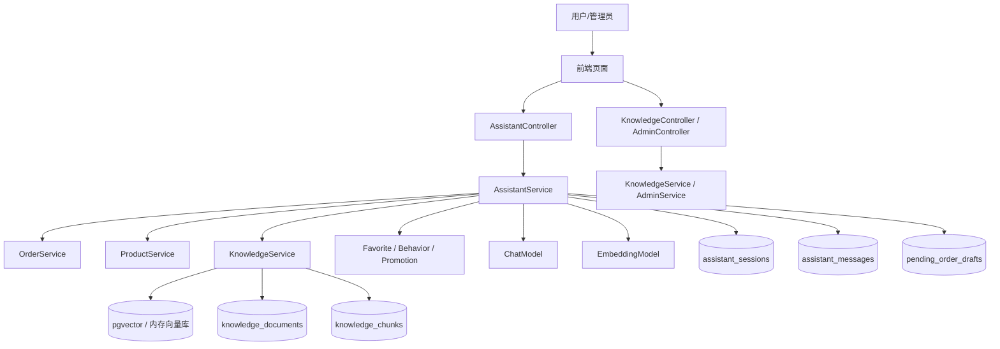

# AI 功能全链路说明

> 这份文档专门讲 AI 功能，按“从前端入口 -> 后端处理 -> 模型/知识库 -> 工具调用 -> 结果回传”的顺序展开。
> 你可以一边看这里，一边对照源码阅读。

## 1. 这套 AI 功能到底包括什么

这个项目里的 AI 不是一个单独聊天框，而是一整条业务链路。它包含这些能力：

- 客户端 AI 客服聊天
- 商品推荐与商品导购
- 订单查询、物流查询、发票查询
- 售后规则问答、退款/退货引导
- 订单代办动作：支付、取消、确认收货、退款、改地址
- 下单草稿生成与确认
- 转人工客服与人工回复回流
- 知识库导入、切块、向量化、检索
- 运行态检查：当前是本地兜底还是远程真模型
- 后台 AI 会话接管、转交、回复、结案

你可以把它理解成一句话：

> 模型负责理解和表达，业务层负责执行和约束，知识库负责补事实，前端负责展示和引导。

---

## 2. 总体架构

主链路可以记成：

`页面 -> Controller -> Service -> 业务数据/知识库 -> 模型 -> 返回结构化结果`

---

## 3. 先看入口：前端是怎么把 AI 请求发出去的

客户端的 AI 入口在 [C:/Users/86187/Desktop/老桌面/学习笔记/Java学习/大三暑假/ai_shop/src/main/resources/static/scripts/client-app.js:2709](C:/Users/86187/Desktop/老桌面/学习笔记/Java学习/大三暑假/ai_shop/src/main/resources/static/scripts/client-app.js:2709)。

### 3.1 `sendAssistantMessage()`

这个函数做了几件事：

1. 检查用户是否登录。
2. 读取输入框里的消息。
3. 如果当前还没有会话，就先 `createSession()`。
4. 把 `sessionId`、`message`、`threadId` 发到 `/api/assistant/chat`。
5. 拿到返回值后更新本地状态：
   - `sessionId`
   - `threadId`
   - `assistantContext`
6. 再去刷新会话列表和订单列表。

对应代码里你会看到返回 payload 里有：

- `answer`
- `intent`
- `threadId`
- `sources`
- `pendingOrderDraft`
- `suggestedActions`

### 3.2 运行态面板

客户端和后台都会调用 `/api/assistant/health`：

- 客户端加载运行态在 [client-app.js:1321](C:/Users/86187/Desktop/老桌面/学习笔记/Java学习/大三暑假/ai_shop/src/main/resources/static/scripts/client-app.js:1321)
- 后台加载运行态在 [admin-app.js:2815](C:/Users/86187/Desktop/老桌面/学习笔记/Java学习/大三暑假/ai_shop/src/main/resources/static/scripts/admin-app.js:2815)

这个接口不是“摆设”，它负责告诉你：

- 当前是 `REMOTE_MODEL` 还是 `LOCAL_FALLBACK`
- 当前向量库是 `PGVECTOR` 还是 `IN_MEMORY`
- 当前有没有拿到 `OPENAI_API_KEY`
- 当前索引规模多大
- 有没有警告

这就是你判断“项目到底有没有接上真 AI”的最直接证据。

---

## 4. 后端总入口：Controller 做了什么

### 4.1 客户端 AI 入口

[`AssistantController.java`](C:/Users/86187/Desktop/老桌面/学习笔记/Java学习/大三暑假/ai_shop/src/main/java/com/aishop/web/AssistantController.java)

- `GET /api/assistant/health` -> 运行态检查
- `POST /api/assistant/chat` -> 真正的对话入口
- `GET /api/assistant/sessions` -> 拉取会话列表
- `POST /api/assistant/sessions` -> 新建会话
- `GET /api/assistant/sessions/{id}` -> 会话详情
- `POST /api/assistant/sessions/{id}/escalate` -> 转人工
- `GET /api/assistant/sessions/{id}/messages` -> 消息历史

这里最重要的是 `POST /api/assistant/chat`：

它先通过 `AuthService.requireUser(session)` 校验登录，再把请求交给 `AssistantService.chat()`。

### 4.2 知识库入口

[`KnowledgeController.java`](C:/Users/86187/Desktop/老桌面/学习笔记/Java学习/大三暑假/ai_shop/src/main/java/com/aishop/web/KnowledgeController.java)

- `POST /api/knowledge/import` -> 导入知识文档
- `GET /api/knowledge/search` -> 直接搜索知识库

后台还有管理端对应接口：

[`AdminController.java`](C:/Users/86187/Desktop/老桌面/学习笔记/Java学习/大三暑假/ai_shop/src/main/java/com/aishop/web/AdminController.java)

- `GET /api/admin/knowledge/search`
- `POST /api/admin/knowledge/reindex`
- `POST /api/admin/knowledge/import`
- `GET /api/admin/assistant/sessions`
- `GET /api/admin/assistant/escalations`
- `GET /api/admin/assistant/sessions/{id}/messages`
- `POST /api/admin/assistant/sessions/{id}/claim`
- `POST /api/admin/assistant/sessions/{id}/assign`
- `POST /api/admin/assistant/sessions/{id}/reply`
- `GET /api/admin/assistant/drafts`

也就是说，AI 不只是客户端聊天，还包括后台知识管理和人工接管。

---

## 5. 真正的主链路：AssistantService

核心文件是 [AssistantService.java](C:/Users/86187/Desktop/老桌面/学习笔记/Java学习/大三暑假/ai_shop/src/main/java/com/aishop/service/AssistantService.java)。

### 5.1 `chat()` 的执行顺序

`chat()` 从 [AssistantService.java:130](C:/Users/86187/Desktop/老桌面/学习笔记/Java学习/大三暑假/ai_shop/src/main/java/com/aishop/service/AssistantService.java:130) 开始，顺序是：

1. 校验用户不能为空。
2. 获取或创建会话 `AssistantSession`。
3. 组装 `threadId`，默认是 `assistant-<sessionId>`。
4. 打日志，记录本次用户、会话、线程、消息摘要。
5. 试着调用 `assistantGraph.invoke(...)`。
6. 做意图识别 `detectIntent()`。
7. 拉取业务上下文：
   - 商品检索
   - 收藏商品
   - 最近行为
   - 最近订单
   - 知识库命中
8. 先尝试直接执行动作 `executeDirectAction()`。
9. 如果不能直接执行，再走 `buildAnswer()` 让模型生成回答。
10. 必要时生成下单草稿 `buildDraftIfNeeded()`。
11. 生成建议动作 `buildSuggestedActions()`。
12. 保存会话摘要、用户消息、AI 消息。
13. 返回 `ChatResponse` 给前端。

### 5.2 `assistantGraph.invoke()` 的作用

`assistantGraph.invoke(...)` 不是当前业务决策的核心，它更多是在做会话状态和 checkpoint 的占位。

你在 [GraphConfig.java](C:/Users/86187/Desktop/老桌面/学习笔记/Java学习/大三暑假/ai_shop/src/main/java/com/aishop/config/GraphConfig.java) 里会看到：

- 图只有一个 passthrough 节点
- `graphId` 是 `assistant-workflow`
- `threadId` 会进入图配置
- 如果启用了真模型，会挂上 checkpoint saver

它的意义是：

> 让对话有线程概念、有状态留痕，也给后续扩展成更复杂 agent 留口子。

但当前真正做判断的，还是 `AssistantService` 里手写的业务路由。

---

## 6. 意图识别：用户这句话到底想干什么

意图识别入口在 [AssistantService.java:773](C:/Users/86187/Desktop/老桌面/学习笔记/Java学习/大三暑假/ai_shop/src/main/java/com/aishop/service/AssistantService.java:773)。

### 6.1 大类意图

系统先把用户的话粗分成这些域：

- `handoff`：转人工
- `promotion`：优惠活动
- `after_sales`：退款、退货、售后
- `profile`：修改地址
- `order`：下单、支付、物流、发票
- `product`：商品推荐
- `rag`：规则/FAQ
- `chat`：普通聊天

### 6.2 细粒度意图

再往下会拆成更具体的判断：

- [AssistantService.java:841](C:/Users/86187/Desktop/老桌面/学习笔记/Java学习/大三暑假/ai_shop/src/main/java/com/aishop/service/AssistantService.java:841) `isPaymentIntent()`
- [AssistantService.java:864](C:/Users/86187/Desktop/老桌面/学习笔记/Java学习/大三暑假/ai_shop/src/main/java/com/aishop/service/AssistantService.java:864) `isRefundIntent()`
- [AssistantService.java:869](C:/Users/86187/Desktop/老桌面/学习笔记/Java学习/大三暑假/ai_shop/src/main/java/com/aishop/service/AssistantService.java:869) `isAddressIntent()`
- [AssistantService.java:880](C:/Users/86187/Desktop/老桌面/学习笔记/Java学习/大三暑假/ai_shop/src/main/java/com/aishop/service/AssistantService.java:880) `isKnowledgePolicyIntent()`
- [AssistantService.java:885](C:/Users/86187/Desktop/老桌面/学习笔记/Java学习/大三暑假/ai_shop/src/main/java/com/aishop/service/AssistantService.java:885) `isPromotionIntent()`
- [AssistantService.java:896](C:/Users/86187/Desktop/老桌面/学习笔记/Java学习/大三暑假/ai_shop/src/main/java/com/aishop/service/AssistantService.java:896) `isHumanSupportIntent()`
- [AssistantService.java:911](C:/Users/86187/Desktop/老桌面/学习笔记/Java学习/大三暑假/ai_shop/src/main/java/com/aishop/service/AssistantService.java:911) `wantsDirectExecution()`

### 6.3 槽位提取

除了“想干什么”，系统还要知道“对哪个对象、带什么参数”：

- 订单号：`ORD-XXXXXXXX`
- 数量：`extractRequestedQuantity()`
- 支付方式：`extractPaymentMethod()`
- 收货地址：`extractNewShippingAddress()`
- 备注：`extractActionNote()`

这些都在 `AssistantService` 里做，核心目的不是 NLP 炫技，而是把自然语言转成业务可执行参数。

### 6.4 为什么不用纯模型分类

因为这个项目的场景很稳定，电商客服的主诉求就那几类。
规则分类的优点是：

- 可解释
- 可控
- 容易排障
- 不依赖模型稳定性

所以这里采用的是“规则优先、模型补充”的方式。

---

## 7. Tool calling / 直接动作执行

这部分是 AI 功能里最像 agent 的地方，但它不是“模型自己发工具调用”，而是 Java 服务自己在做编排。

入口在 [AssistantService.java:387](C:/Users/86187/Desktop/老桌面/学习笔记/Java学习/大三暑假/ai_shop/src/main/java/com/aishop/service/AssistantService.java:387) 的 `executeDirectAction()`。

### 7.1 执行顺序

系统会按顺序判断：

1. 是否转人工
2. 是否支付
3. 是否取消订单
4. 是否确认收货
5. 是否退款
6. 是否修改地址

每个动作都必须满足两个条件：

- 用户明确表达了“我要直接做”
- 当前订单状态允许做

### 7.2 关键防护点

#### 支付

- 只有 `canPay()` 为真才允许
- 不能支付时，会直接提示订单状态不支持

#### 取消订单

- 只有待支付/已确认/处理中等可取消状态才允许
- 不能取消时直接拒绝

#### 确认收货

- 只有已发货订单才允许

#### 退款

- 只有符合退款条件的订单才允许

#### 改地址

- 只有支持改地址的状态才允许

#### 转人工

- 只要用户明确要求，就会把会话标记为 `ESCALATED`

### 7.3 多订单歧义怎么处理

如果用户没说清是哪一单，系统不会盲目猜。

它会走 `resolveDirectActionOrder()`：

- 如果只有一单符合条件，直接用
- 如果有多单，优先看“最近/最新”
- 如果还不清楚，就让用户补订单号

这就是防越权的关键之一：

> 没有明确目标，不执行高风险动作。

### 7.4 `buildSuggestedActions()` 的意义

这个函数不是工具执行本身，而是“下一步引导”。

它会给前端返回一组按钮建议，例如：

- 再查订单状态
- 看物流
- 申请退款
- 生成草稿
- 转人工
- 继续问规则

前端点击这些按钮，本质上是再发一条预填充消息，而不是直接执行后台动作。

---

## 8. 草稿单：为什么 AI 不直接下单

草稿生成在 [AssistantService.java:538](C:/Users/86187/Desktop/老桌面/学习笔记/Java学习/大三暑假/ai_shop/src/main/java/com/aishop/service/AssistantService.java:538) 的 `buildDraftIfNeeded()`。

### 8.1 触发条件

只有同时满足下面两个条件才会生成草稿：

- 意图是 `order`
- 用户话里有购买意图 `isPurchaseIntent()`

### 8.2 草稿怎么生成

它会调用 [OrderService.java:93](C:/Users/86187/Desktop/老桌面/学习笔记/Java学习/大三暑假/ai_shop/src/main/java/com/aishop/service/OrderService.java:93) 的 `buildDraft()`。

草稿里会保存：

- `productId`
- `productName`
- `quantity`
- `unitPrice`
- `totalAmount`
- `note`

草稿表是 `pending_order_drafts`。

### 8.3 用户确认后才正式落单

确认入口在 [OrderService.java:121](C:/Users/86187/Desktop/老桌面/学习笔记/Java学习/大三暑假/ai_shop/src/main/java/com/aishop/service/OrderService.java:121) 的 `confirmDraft()`：

- 先校验草稿归属
- 再校验草稿状态
- 再扣库存
- 再创建正式订单和订单项
- 再记录时间线

也就是说：

> AI 只帮你生成建议单，真正的订单仍然要用户确认。

这就是很典型的“AI 提效 + 业务可控”。

---

## 9. RAG：知识库是怎么接进来的

知识库链路在 [KnowledgeService.java](C:/Users/86187/Desktop/老桌面/学习笔记/Java学习/大三暑假/ai_shop/src/main/java/com/aishop/service/KnowledgeService.java)。

### 9.1 原文存哪里

原文存在：

- `knowledge_documents.content`

对应实体是 `KnowledgeDocument`。

### 9.2 切块存哪里

切块后的文本存在：

- `knowledge_chunks.chunkText`

对应实体是 `KnowledgeChunk`。

### 9.3 向量存哪里

每个 chunk 的 embedding 先缓存到：

- `knowledge_chunks.embeddingJson`

如果启用了 pgvector，还会同步到向量表：

- `knowledge_embeddings`

### 9.4 导入流程

在 [KnowledgeService.java:58](C:/Users/86187/Desktop/老桌面/学习笔记/Java学习/大三暑假/ai_shop/src/main/java/com/aishop/service/KnowledgeService.java:58) 的 `importDocument()` 中：

1. 新建知识文档。
2. 保存原文。
3. 对内容切块。
4. 每块调用 `embeddingModel.embed(...)`。
5. 把 embedding 序列化到 `embeddingJson`。
6. 调 `embeddingStore.upsert(...)` 写入向量库。

### 9.5 检索流程

在 [KnowledgeService.java:86](C:/Users/86187/Desktop/老桌面/学习笔记/Java学习/大三暑假/ai_shop/src/main/java/com/aishop/service/KnowledgeService.java:86) 的 `search()` 中：

1. 先标准化查询词。
2. 生成 query embedding。
3. 同时做文本命中和向量命中。
4. 合并候选结果。
5. 按综合分数排序。
6. 返回 topK 结果。

### 9.6 为什么是混合检索

因为电商规则类问题经常有明确关键词：

- 退款
- 退货
- 发票
- 物流
- 售后

只靠向量不稳，只靠关键词又不够灵活，所以这里做了：

- 文本匹配
- 语义向量匹配
- 混合排序

你在 `SearchCandidate` 里还能看到：

- `matchMode()` -> `TEXT` / `VECTOR` / `HYBRID`
- `displayScore()`
- `matchedTermsText()`
- `embeddingDimensions()`

### 9.7 为什么要启动时重建索引

[`KnowledgeIndexSynchronizer.java`](C:/Users/86187/Desktop/老桌面/学习笔记/Java学习/大三暑假/ai_shop/src/main/java/com/aishop/service/KnowledgeIndexSynchronizer.java) 在启动时会同步全部 chunk。

它的作用是：

- 防止上次异常退出导致索引缺失
- 防止 embedding 维度变了但缓存还留着旧值
- 防止知识库和向量库状态不一致

这就是一个很标准的“启动时确定性修复”。

---

## 10. 模型到底怎么切换：真 AI vs 本地兜底

### 10.1 真模型装配

[`AiModelConfig.java`](C:/Users/86187/Desktop/老桌面/学习笔记/Java学习/大三暑假/ai_shop/src/main/java/com/aishop/config/AiModelConfig.java)

只有当 `shop.ai.enabled=true` 时，才会创建：

- `ChatModel`
- `EmbeddingModel`

并走 OpenAI 兼容接口，当前默认指向 DashScope 兼容地址。

### 10.2 本地兜底装配

[`LocalChatModelConfig.java`](C:/Users/86187/Desktop/老桌面/学习笔记/Java学习/大三暑假/ai_shop/src/main/java/com/aishop/config/LocalChatModelConfig.java)

[`LocalEmbeddingConfig.java`](C:/Users/86187/Desktop/老桌面/学习笔记/Java学习/大三暑假/ai_shop/src/main/java/com/aishop/config/LocalEmbeddingConfig.java)

如果没有真模型 Bean，就会启用本地兜底：

- 聊天回复使用本地简化逻辑
- embedding 使用 64 维简化向量
- 向量检索走内存存储

本地模式适合：

- 没有 Key
- 网络不通
- 想先联调业务流程

但它不代表真实 AI 效果。

### 10.3 如何判断当前到底是什么模式

看 [AssistantRuntimeStatusService.java:47](C:/Users/86187/Desktop/老桌面/学习笔记/Java学习/大三暑假/ai_shop/src/main/java/com/aishop/service/AssistantRuntimeStatusService.java:47) 的 `runtimeHealth()`：

- `mode`
- `provider`
- `apiKeyConfigured`
- `chatModelName`
- `embeddingModelName`
- `vectorStoreType`
- `vectorStorePersistent`
- `knowledgeDocumentCount`
- `knowledgeChunkCount`
- `indexedSegmentCount`
- `warnings`

这也是前端运行态面板展示的数据来源。

---

## 11. 后台是怎么接管 AI 会话的

后台 AI 能力主要在 `AdminController` + `AdminService`。

### 11.1 会话列表

后台可以拉：

- 全部 AI 会话
- 人工接管中的会话
- 待处理草稿

对应方法：

- `listAssistantSessions()`
- `listEscalatedAssistantSessions()`
- `listPendingAssistantDrafts()`

### 11.2 会话内容

后台可以查看会话消息：

- `assistantMessages(sessionId)`

### 11.3 人工接管

后台可以：

- `claimAssistantSession()`：认领会话
- `assignAssistantSession()`：转交给别的客服
- `replyAssistantSession()`：回复会话

当人工回复后，会话状态会从 `ESCALATED` 变成 `RESOLVED` 或继续保持跟进状态。

### 11.4 前端如何体现

后台前端在 [admin-app.js:2763](C:/Users/86187/Desktop/老桌面/学习笔记/Java学习/大三暑假/ai_shop/src/main/resources/static/scripts/admin-app.js:2763) 拉取：

- 会话
- escalation 列表
- 草稿

然后在 [admin-app.js:2815](C:/Users/86187/Desktop/老桌面/学习笔记/Java学习/大三暑假/ai_shop/src/main/resources/static/scripts/admin-app.js:2815) 再拉一次 `/api/assistant/health`。

所以后台不是“看个列表”，而是能直接接管 AI 处理链路。

---

## 12. AI 相关数据表

### 12.1 知识库

- `knowledge_documents`
  - 存知识原文、标题、类型
- `knowledge_chunks`
  - 存切块文本、embeddingJson、document 关联
- `knowledge_embeddings`
  - pgvector 实际向量表，由库创建和维护

### 12.2 对话会话

- `assistant_sessions`
  - 会话标题
  - summary
  - lastIntent
  - serviceStatus
  - assignedAdmin
  - unread counts
  - 时间字段

- `assistant_messages`
  - session 关联
  - role
  - content

### 12.3 草稿和订单

- `pending_order_drafts`
  - threadId
  - draftJson
  - status

- `orders`
  - AI 代办的最终结果
- `order_items`
  - 订单商品快照

### 12.4 行为和画像

AI 还会读取：

- 收藏
- 浏览/咨询行为
- 最近订单
- 用户默认地址

这些不一定是 AI 专用表，但它们是 AI 生成更像“懂业务”的回答所需的上下文。

---

## 13. 典型场景怎么走

### 13.1 “退款和退货规则是什么”

1. 前端发到 `/api/assistant/chat`
2. `detectIntent()` 命中 `after_sales` / `rag`
3. `knowledgeService.search()` 检索规则文档
4. `buildAnswer()` 使用知识片段组织回答
5. 返回 `sources` 给前端

这是最标准的 RAG 问答。

### 13.2 “帮我直接取消订单 ORD-12345678”

1. 意图识别命中 `order`
2. `wantsDirectExecution()` 为真
3. `findExactMentionedOrder()` 找到订单
4. `canCancel()` 检查状态
5. 调 `orderService.cancelOrder()`
6. 返回执行结果

这是标准的工具调用/业务代办。

### 13.3 “给我推荐一款适合通勤的耳机”

1. 意图识别命中 `product`
2. `productService.search()` 找候选商品
3. 结合收藏、行为、订单上下文
4. 组 prompt 给模型
5. 返回推荐结果和建议动作

### 13.4 “帮我转人工”

1. `isHumanSupportIntent()` 命中
2. 会话状态变成 `ESCALATED`
3. 客户端/后台都能看到这条会话进入人工队列
4. 后台可认领、转交、回复、结案

### 13.5 “把订单改成上海地址”

1. 命中 `profile` / `address`
2. `wantsDirectExecution()` 为真
3. 先提取新地址
4. 再判断订单状态能不能改
5. 能改才调用 `updateShippingAddress()`

---

## 14. 你读源码时建议按这个顺序

1. [client-app.js:1321](C:/Users/86187/Desktop/老桌面/学习笔记/Java学习/大三暑假/ai_shop/src/main/resources/static/scripts/client-app.js:1321)
2. [client-app.js:2709](C:/Users/86187/Desktop/老桌面/学习笔记/Java学习/大三暑假/ai_shop/src/main/resources/static/scripts/client-app.js:2709)
3. [AssistantController.java:40](C:/Users/86187/Desktop/老桌面/学习笔记/Java学习/大三暑假/ai_shop/src/main/java/com/aishop/web/AssistantController.java:40)
4. [AssistantService.java:130](C:/Users/86187/Desktop/老桌面/学习笔记/Java学习/大三暑假/ai_shop/src/main/java/com/aishop/service/AssistantService.java:130)
5. [AssistantService.java:387](C:/Users/86187/Desktop/老桌面/学习笔记/Java学习/大三暑假/ai_shop/src/main/java/com/aishop/service/AssistantService.java:387)
6. [AssistantService.java:538](C:/Users/86187/Desktop/老桌面/学习笔记/Java学习/大三暑假/ai_shop/src/main/java/com/aishop/service/AssistantService.java:538)
7. [AssistantService.java:568](C:/Users/86187/Desktop/老桌面/学习笔记/Java学习/大三暑假/ai_shop/src/main/java/com/aishop/service/AssistantService.java:568)
8. [AssistantService.java:773](C:/Users/86187/Desktop/老桌面/学习笔记/Java学习/大三暑假/ai_shop/src/main/java/com/aishop/service/AssistantService.java:773)
9. [KnowledgeService.java:58](C:/Users/86187/Desktop/老桌面/学习笔记/Java学习/大三暑假/ai_shop/src/main/java/com/aishop/service/KnowledgeService.java:58)
10. [KnowledgeService.java:86](C:/Users/86187/Desktop/老桌面/学习笔记/Java学习/大三暑假/ai_shop/src/main/java/com/aishop/service/KnowledgeService.java:86)
11. [AssistantRuntimeStatusService.java:47](C:/Users/86187/Desktop/老桌面/学习笔记/Java学习/大三暑假/ai_shop/src/main/java/com/aishop/service/AssistantRuntimeStatusService.java:47)
12. [AdminController.java](C:/Users/86187/Desktop/老桌面/学习笔记/Java学习/大三暑假/ai_shop/src/main/java/com/aishop/web/AdminController.java)
13. [AdminService.java](C:/Users/86187/Desktop/老桌面/学习笔记/Java学习/大三暑假/ai_shop/src/main/java/com/aishop/service/AdminService.java)

---

## 15. 最后把这条链路记成一句话

> 用户从前端发起问题后，后端先做意图识别和上下文收集；如果是可执行动作，就走业务服务和状态校验；如果是知识问题，就走 RAG 检索后交给模型组织答案；如果是复杂问题，就转人工；最后把答案、来源、草稿和建议动作统一回传给前端。

这句话基本就是整个 AI 模块的总纲。
