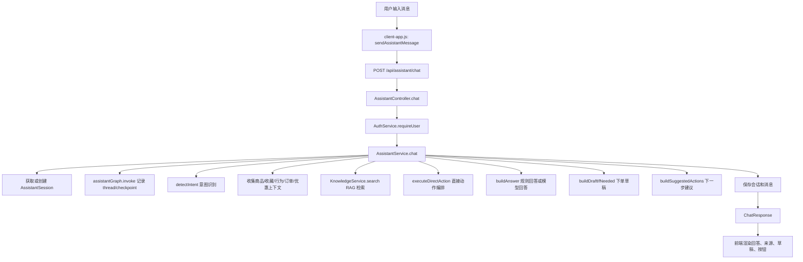

# AI 客服全链路源码讲解

这份文档专门讲“AI 客服”这一块，不只讲它能聊天，而是从用户在输入框里发出一句话开始，顺着前端、接口、业务服务、RAG、模型调用、订单动作、消息存储、前端渲染、人工接管，把完整链路讲清楚。

阅读源码时可以按本文顺序看。本文行号基于当前版本，后续代码调整后行号可能变化，但文件和方法名仍然是主要索引。

## 1. 一句话总览

AI 客服的完整调用链路可以概括为：

```text
用户输入
  -> 前端 sendAssistantMessage()
  -> POST /api/assistant/chat
  -> AssistantController.chat()
  -> AssistantService.chat()
  -> 会话创建/恢复、意图识别、业务上下文收集、RAG 检索
  -> 直接业务动作 或 规则回答 或 大模型回答
  -> 生成下单草稿、建议动作、知识来源
  -> 保存 assistant_sessions / assistant_messages
  -> 返回 ChatResponse
  -> 前端渲染回答、来源、草稿、下一步按钮
```

它最核心的设计思想是：

> 大模型负责自然语言表达和兜底生成，Java 业务层负责判断、约束和真正执行动作。

所以这个项目里的 AI 客服不是一个孤立聊天框，而是嵌进电商业务流程里的“可控 AI 助手”。



## 2. 前端入口：用户点击发送后发生什么

客户侧页面的主要代码在：

- `src/main/resources/static/scripts/client-app.js`

核心发送方法是：

- `sendAssistantMessage()`：`client-app.js:2709`

它做的事情是：

1. 判断用户是否已经登录。没有登录就直接抛错，不允许匿名使用 AI 客服。
2. 读取输入框内容，或者读取按钮预置的 prompt。
3. 如果当前没有客服会话，先调用 `createSession()` 创建会话。
4. 调用后端 `POST /api/assistant/chat`。
5. 把后端返回的 `sessionId`、`threadId`、`assistantContext` 写回前端状态。
6. 清空输入框。
7. 调用 `renderAssistantMeta(payload)` 展示本轮 AI 元信息。
8. 刷新会话列表和订单列表。

关键请求体是：

```javascript
const payload = await clientFetchJson("/api/assistant/chat", {
  method: "POST",
  body: JSON.stringify({
    sessionId: clientState.sessionId,
    message: finalMessage,
    threadId: clientState.threadId,
  }),
});
```

这里有三个参数很重要：

| 字段 | 含义 |
| --- | --- |
| `sessionId` | 当前 AI 客服会话 ID，用来把消息归到同一条会话 |
| `message` | 用户本轮输入的自然语言 |
| `threadId` | 会话线程 ID，默认类似 `assistant-1`，也用于下单草稿和 LangGraph checkpoint |

### 2.1 前端如何展示 AI 返回结果

AI 返回后，前端不是只展示一段文本，而是展示一组结构化结果：

- 回答文本：由消息历史区域显示。
- 当前意图：由 `renderAssistantMeta()` 显示。
- 知识库来源：由 `renderAssistantSources()` 显示。
- 下单草稿状态：由 `renderAssistantDraft()` 显示。
- 下一步按钮：由 `renderAssistantActionButtons()` 显示。

对应代码：

- `renderAssistantMessages()`：`client-app.js:2323`
- `renderAssistantMeta()`：`client-app.js:2345`
- `renderAssistantDraft()`：`client-app.js:2415`
- `confirmAssistantDraft()`：`client-app.js:2762`
- `cancelAssistantDraft()`：`client-app.js:2776`

这说明后端返回的不是普通字符串，而是一个“可驱动页面继续操作”的结构化响应。

## 3. 后端入口：Controller 只做鉴权和转发

AI 客服的后端入口在：

- `src/main/java/com/aishop/web/AssistantController.java`

最关键接口是：

```java
@PostMapping("/api/assistant/chat")
public ChatResponse chat(HttpSession session, @RequestBody ChatRequest request) {
    var user = authService.requireUser(session);
    return assistantService.chat(user, request.sessionId(), request.message(), request.threadId());
}
```

源码位置：

- `AssistantController.chat()`：`AssistantController.java:46`

这里有两个重点：

1. `authService.requireUser(session)` 会先从当前 HTTP Session 里拿登录用户。
2. Controller 不做复杂逻辑，直接把用户、会话 ID、消息、线程 ID 交给 `AssistantService.chat()`。

这样设计的好处是职责清楚：

| 层 | 责任 |
| --- | --- |
| 前端 | 收集用户输入，展示结构化结果 |
| Controller | 鉴权，接收请求，返回 DTO |
| Service | AI 客服主流程、意图判断、工具编排、模型调用 |
| Repository/Domain | 数据落库 |

## 4. 请求和响应 DTO

DTO 在：

- `src/main/java/com/aishop/dto/AssistantDtos.java`

请求对象：

```java
public record ChatRequest(Long sessionId, String message, String threadId) {}
```

响应对象：

```java
public record ChatResponse(
    Long sessionId,
    String answer,
    String intent,
    String threadId,
    List<KnowledgeSourceResponse> sources,
    String pendingOrderDraft,
    List<SuggestedActionResponse> suggestedActions
) {}
```

字段解释：

| 字段 | 作用 |
| --- | --- |
| `sessionId` | 当前会话 ID |
| `answer` | AI 客服最终展示给用户的回答 |
| `intent` | 本轮识别出的意图，如 `order`、`product`、`after_sales` |
| `threadId` | 会话线程 ID，用于 LangGraph 和下单草稿关联 |
| `sources` | RAG 命中的知识片段来源 |
| `pendingOrderDraft` | 本轮生成的下单草稿 JSON |
| `suggestedActions` | 下一步建议按钮，比如继续查订单、申请退款、转人工 |

这里是项目的一个亮点：后端没有把 AI 当成“只返回一段话”的接口，而是返回可解释、可追踪、可继续执行的结构化结果。

## 5. 核心主链路：AssistantService.chat()

真正核心文件是：

- `src/main/java/com/aishop/service/AssistantService.java`

主方法是：

- `chat()`：`AssistantService.java:130`

它是一条完整的 AI 客服工作流。可以按下面顺序读：

### 5.1 校验用户并获取会话

第一步先检查用户：

```java
if (user == null) {
    throw new IllegalArgumentException("请先登录");
}
```

然后通过 `getOrCreateSession(user, sessionId)` 获取或创建 `AssistantSession`。

如果用户传了 `sessionId`，系统会查这个会话是否属于当前用户。如果没传，就创建一条新会话。

这一点也是越权防护的一部分：用户不能随便拿别人的会话 ID 查别人消息。

### 5.2 维护 threadId

代码里会生成当前线程 ID：

```java
var currentThreadId = threadId == null || threadId.isBlank()
        ? "assistant-" + session.getId()
        : threadId;
```

`threadId` 的作用有两个：

1. 给 LangGraph checkpoint 使用，让对话有线程概念。
2. 给 AI 下单草稿使用，保证某个草稿属于某一轮会话上下文。

### 5.3 调用 assistantGraph.invoke()

源码位置：

- `AssistantService.java:145`
- `src/main/java/com/aishop/config/GraphConfig.java`

`assistantGraph.invoke(...)` 当前不是复杂 agent 推理，它更像是一个轻量的工作流占位和状态 checkpoint 入口。

在 `GraphConfig` 里可以看到：

- 图里只有一个 `start` 节点。
- 节点逻辑是 passthrough。
- `graphId` 是 `assistant-workflow`。
- 当 `shop.ai.enabled=true` 时，会挂 checkpoint saver。
- PostgreSQL 环境下优先用 `PostgresSaver`，否则用 `MemorySaver`。

所以当前项目的真实决策中心不是 LangGraph，而是 `AssistantService` 里的 Java 业务编排。这个点面试时要讲清楚：

> 这里引入 LangGraph4j 是为了给后续复杂 agent 工作流预留状态能力，当前版本主要用它保存线程化上下文入口，真正的工具规划仍由 Java 服务控制。

### 5.4 意图识别

源码位置：

- `detectIntent()`：`AssistantService.java:773`

系统先把用户输入分成大类：

| intent | 含义 |
| --- | --- |
| `handoff` | 转人工 |
| `promotion` | 优惠、活动、优惠码 |
| `after_sales` | 退款、退货、售后、保修 |
| `profile` | 地址、用户资料相关 |
| `order` | 下单、订单、支付、发货、物流、发票 |
| `product` | 商品咨询、商品推荐 |
| `rag` | FAQ、规则、知识库 |
| `chat` | 普通兜底聊天 |

除了大类，还有细粒度判断：

- `isPurchaseIntent()`：是否想购买或下单。
- `isOrderLookupIntent()`：是否想查订单。
- `isLogisticsSpecificIntent()`：是否想查物流。
- `isPaymentIntent()`：是否涉及支付。
- `isCancelIntent()`：是否涉及取消订单。
- `isConfirmReceiptIntent()`：是否涉及确认收货。
- `isRefundIntent()`：是否涉及退款/退货/售后。
- `isAddressIntent()`：是否涉及改地址。
- `isPromotionIntent()`：是否涉及优惠活动。
- `isHumanSupportIntent()`：是否要求转人工。
- `wantsDirectExecution()`：是否明确要求系统“直接帮我做”。

其中 `wantsDirectExecution()` 很关键，它用来区分两种话：

| 用户说法 | 系统行为 |
| --- | --- |
| “怎么支付订单？” | 只回答支付步骤，不直接支付 |
| “帮我直接支付 ORD-XXXX” | 尝试执行支付动作 |
| “退款规则是什么？” | 查知识库或给规则说明 |
| “帮我申请这个订单退款” | 尝试执行退款申请 |

这就是用户意图识别和工具调用之间的分界线。

### 5.5 收集业务上下文

意图识别之后，系统开始收集业务数据。核心代码集中在 `AssistantService.chat()` 中间部分：

```java
var matchedProducts = productService.search(message).stream().limit(3).toList();
var favoriteProducts = favoriteService.recentFavoriteProducts(user, 3);
var behaviorProducts = behaviorService.recentInterestedProducts(user, 3);
var behaviorSummary = behaviorService.summarizeRecentBehavior(user, 6);
var allOrders = orderService.listOrders(user);
var recentOrders = allOrders.stream().limit(3).toList();
var exactOrder = findExactMentionedOrder(message, allOrders);
var knowledgeHits = knowledgeService.search(message).stream().limit(3).toList();
```

上下文来源如下：

| 上下文 | 代码 | 用途 |
| --- | --- | --- |
| 商品搜索 | `ProductService.search()` | 识别用户提到的商品，做推荐或下单草稿 |
| 收藏商品 | `ProductFavoriteService.recentFavoriteProducts()` | 没明确商品时，用收藏做个性化推荐 |
| 浏览/加购/咨询行为 | `CustomerBehaviorService.recentInterestedProducts()` | 理解“刚才那个”“我看过的”这类模糊表达 |
| 行为摘要 | `CustomerBehaviorService.summarizeRecentBehavior()` | 拼进 prompt，让模型知道用户偏好 |
| 最近订单 | `OrderService.listOrders(user)` | 查订单、物流、售后、支付等 |
| 精确订单号 | `findExactMentionedOrder()` | 用户提到 `ORD-XXXXXXXX` 时锁定订单 |
| 知识库命中 | `KnowledgeService.search()` | RAG 问答、售后规则、物流政策 |
| 优惠活动 | `PromotionService.listAvailable()` | 回答优惠、推荐最划算商品 |

这里体现了项目的业务价值：AI 不只是看用户这一句话，而是把“用户画像、商品、订单、知识库、活动”一起作为上下文。

### 5.6 判断是否要直接执行动作

源码位置：

- `executeDirectAction()`：`AssistantService.java:387`

`executeDirectAction()` 会优先处理能直接执行的业务动作。如果成功处理，就不再走模型自由生成。

当前支持的直接动作包括：

| 动作 | 触发 | 最终调用 |
| --- | --- | --- |
| 转人工 | 用户明确要求人工客服 | `markSessionEscalated()` |
| 支付 | 支付意图 + 明确直接执行 | `OrderService.payOrder()` |
| 取消订单 | 取消意图 + 明确直接执行 | `OrderService.cancelOrder()` |
| 确认收货 | 确认收货意图 + 明确直接执行 | `OrderService.confirmReceipt()` |
| 申请退款 | 售后/退款意图 + 明确直接执行 | `OrderService.requestRefund()` |
| 修改地址 | 改地址意图 + 明确直接执行 + 提取到新地址 | `OrderService.updateShippingAddress()` |

重点是：这里不是让大模型返回函数名再执行，而是 Java 代码自己判断该调哪个业务服务。

所以更准确的说法是：

> 本项目实现的是 Java 侧 tool orchestration，而不是原生 LLM function calling。

### 5.7 不能直接执行时生成回答

如果 `executeDirectAction()` 返回 `null`，说明本轮不是直接动作，或者不满足直接执行条件。

这时会走：

- `buildPendingHandoffAnswer()`
- `buildAnswer()`：`AssistantService.java:268`

`buildAnswer()` 不是一上来就调用大模型，而是先走业务规则分支：

1. 优惠问题：`buildPromotionAnswer()`
2. 发票问题：`buildInvoiceGuide()`
3. 知识库规则问题：`buildKnowledgeAnswer()`
4. 支付问题：`buildPaymentGuide()`
5. 取消问题：`buildCancelGuide()`
6. 确认收货问题：`buildConfirmReceiptGuide()`
7. 退款问题：`buildRefundGuide()`
8. 地址问题：`buildAddressGuide()`
9. 订单查询：`buildOrderLogisticsAnswer()` 或订单摘要
10. 购买意图：准备下单草稿提示
11. 商品咨询：商品推荐、收藏推荐、行为推荐
12. 最后兜底：拼 prompt 调用 `chatModel.chat(prompt)`

这个顺序很重要。它说明项目不是把所有事情都丢给模型，而是：

> 能确定的业务问题先由规则回答，不能确定的开放表达再交给模型生成。

### 5.8 拼接模型 prompt

兜底调用模型前，会把上下文拼进 prompt。prompt 内容包括：

- 当前用户显示名
- 当前会话 threadId
- 用户消息
- 识别出的 intent
- 默认收货地址
- 候选商品
- 最近收藏
- 最近商品行为
- 最近意向商品
- 最近订单
- 当前活动
- 相关知识库内容
- 回答要求

然后调用：

```java
return chatModel.chat(prompt);
```

模型只负责根据这些已整理好的上下文生成客服式回答。它不能直接改库，也不能绕过 Java 的订单状态校验。

### 5.9 生成下单草稿

源码位置：

- `buildDraftIfNeeded()`：`AssistantService.java:538`
- `OrderService.buildDraft()`：`OrderService.java:93`

触发条件：

1. 本轮意图是 `order`。
2. 用户有购买/下单意图。
3. 当前没有被转人工。
4. 能匹配到商品，或者能从商品列表里取到默认商品。

生成的草稿会存入：

- `pending_order_drafts`

草稿内容包括：

- `productId`
- `productName`
- `quantity`
- `unitPrice`
- `totalAmount`
- `note`

注意：AI 这里只生成草稿，不直接创建正式订单。

用户点击“确认下单”后，前端调用：

- `POST /api/orders/confirm`：`OrderController.java:66`

后端进入：

- `OrderService.confirmDraft()`：`OrderService.java:121`

确认时会做：

1. 根据 `threadId` 找到最新草稿。
2. 校验草稿属于当前用户。
3. 校验草稿状态还是 `PENDING_CONFIRMATION`。
4. 解析草稿 JSON。
5. 扣库存。
6. 创建正式订单 `orders`。
7. 创建订单项 `order_items`。
8. 把草稿状态改成 `CONFIRMED`。
9. 写入订单时间线。

这个设计非常适合面试讲：

> AI 可以辅助用户生成下单建议，但正式订单必须由用户确认，既提升效率，又避免 AI 直接替用户下单带来的风险。

### 5.10 生成下一步建议

源码位置：

- `buildSuggestedActions()`：`AssistantService.java:568`

返回结构是：

```java
public record SuggestedActionResponse(
    String key,
    String label,
    String prompt,
    String kind
) {}
```

它会根据当前意图生成按钮：

| 意图 | 可能生成的按钮 |
| --- | --- |
| `order` | 查订单状态、看物流、直接支付、取消订单、确认收货 |
| `product` | 适合什么人、比较同类商品、生成下单草稿 |
| `promotion` | 查看可用优惠、推荐更划算商品、优惠后下单 |
| `after_sales` | 查看退款规则、查售后状态、申请退款 |
| `profile` | 修改订单地址、查看默认地址 |
| `handoff` | 补充给人工、继续查订单 |
| 默认 | 推荐商品、查询订单、查看优惠、继续问规则 |

前端点击这些按钮，本质上是再发送一条预设 prompt：

- `bindAssistantMetaActions()` 会把按钮 prompt 交给 `sendAssistantMessage()`。

也就是说，建议按钮不是偷偷执行动作，而是把下一步意图显式变成用户消息，再走一遍完整后端链路。

### 5.11 保存会话和消息

最后，`AssistantService.chat()` 会更新会话并保存消息：

```java
session.setLastIntent(intent);
session.setSummary(composeSummary(session.getSummary(), message, answer));
sessionRepository.save(session);

saveMessage(session, "user", message);
saveMessage(session, "assistant", answer);
```

对应表：

- `assistant_sessions`
- `assistant_messages`

`saveMessage()` 还会调用 `updateSessionActivity()`，用于更新最近客户消息时间、未读数等字段。

这意味着 AI 客服消息不是临时显示在前端，而是完整落库，可以被用户查看历史，也可以被后台人工客服接着处理。

## 6. 意图识别和工具规划怎么配合

这一部分可以理解成项目里的“轻量 agent 规划器”。

用户输入一句话后，系统会先问三个问题：

1. 这句话属于哪个大类意图？
2. 用户只是咨询，还是明确要我直接执行？
3. 如果要执行，目标对象和参数是否明确、状态是否允许？

对应代码关系是：

```text
detectIntent(message)
  -> 判断大类 intent

isPaymentIntent / isCancelIntent / isRefundIntent / ...
  -> 判断细粒度动作

wantsDirectExecution(message)
  -> 判断是不是明确要直接执行

findExactMentionedOrder / extractPaymentMethod / extractNewShippingAddress / extractActionNote
  -> 抽取槽位参数

executeDirectAction(...)
  -> 根据意图和参数调用具体业务服务
```

举例：

| 用户输入 | 大类 intent | 直接执行 | 结果 |
| --- | --- | --- | --- |
| “我的订单到哪了？” | `order` | 否 | 查最近订单并回答物流 |
| “帮我直接取消订单 ORD-ABCD1234” | `order` | 是 | 校验状态后调用 `cancelOrder()` |
| “退款规则是什么？” | `after_sales` 或 `rag` | 否 | 走知识库或规则说明 |
| “帮我申请退款” | `after_sales` | 是 | 找可退款订单，调用 `requestRefund()` 或提示补充订单 |
| “这款耳机适合通勤吗？” | `product` | 否 | 商品上下文 + 模型/规则回答 |
| “帮我买这个” | `order` | 否，先草稿 | 生成 `pending_order_drafts` |

设计上的关键点是：

- 咨询类问题只回答，不改数据库。
- 高风险动作必须有明确直接执行意图。
- 执行动作必须通过订单状态和归属校验。
- 找不到明确目标时，优先提示用户补充，不盲目操作。

## 7. 直接动作的安全边界

直接动作看起来像“AI 会操作订单”，但真正执行的是 `OrderService`。

核心安全点有三层。

### 7.1 第一层：当前登录用户

所有入口都从 `HttpSession` 取当前用户：

- `AssistantController.chat()` 调用 `authService.requireUser(session)`
- `OrderController` 里的订单动作也调用 `authService.requireUser(session)`

所以请求必须绑定登录态。

### 7.2 第二层：订单必须属于当前用户

`OrderService` 里的关键方法都会调用：

- `requireOwnedOrder()`：`OrderService.java:433`

例如：

- `payOrder()`：`OrderService.java:271`
- `cancelOrder()`：`OrderService.java:245`
- `confirmReceipt()`：`OrderService.java:299`
- `requestRefund()`：`OrderService.java:322`
- `updateShippingAddress()`：`OrderService.java:216`

`requireOwnedOrder()` 会查订单，并校验订单的 `user_id` 是否等于当前用户 ID。不是自己的订单就抛异常。

这就是 AI 越权防护的核心：

> 即使用户在聊天里输入了别人的订单号，真正执行订单服务时也过不了归属校验。

### 7.3 第三层：订单状态必须允许

`AssistantService` 里有一组状态判断：

- `canPay()`：只允许 `PENDING_PAYMENT`
- `canCancel()`：允许 `PENDING_PAYMENT`、`CONFIRMED`、`PROCESSING`
- `canConfirmReceipt()`：只允许 `SHIPPED`
- `canRefund()`：允许 `SHIPPED`、`COMPLETED`
- `canUpdateShippingAddress()`：允许 `PENDING_PAYMENT`、`CONFIRMED`、`PROCESSING`

对应源码：

- `AssistantService.java:1426` 到 `AssistantService.java:1444`

`OrderService` 里也会再次校验状态。也就是说状态校验不是只放在 AI 层，业务服务层也有兜底。

这种“双层校验”是比较好的工程实践：

| 层 | 作用 |
| --- | --- |
| `AssistantService` | 提前判断，给用户更友好的客服回答 |
| `OrderService` | 最终防线，保证业务数据不会被非法修改 |

## 8. RAG 功能：知识库从导入到命中

RAG 相关核心文件：

- `src/main/java/com/aishop/service/KnowledgeService.java`
- `src/main/java/com/aishop/service/KnowledgeIndexSynchronizer.java`
- `src/main/java/com/aishop/service/EmbeddingStoreFacade.java`
- `src/main/java/com/aishop/service/PgVectorEmbeddingStoreFacade.java`
- `src/main/java/com/aishop/service/InMemoryEmbeddingStoreFacade.java`
- `src/main/java/com/aishop/config/EmbeddingStoreConfig.java`

### 8.1 知识导入

接口入口：

- `POST /api/knowledge/import`
- `KnowledgeController.importDoc()`

业务方法：

- `KnowledgeService.importDocument()`：`KnowledgeService.java:58`

导入流程：

```text
接收 title/docType/content
  -> 保存原文到 knowledge_documents
  -> splitText() 切分 content
  -> 每个 chunk 保存到 knowledge_chunks
  -> 调用 embeddingModel.embed(chunkText)
  -> embedding 向量 JSON 存入 knowledge_chunks.embeddingJson
  -> 同时 upsert 到 EmbeddingStoreFacade
```

原文存储位置：

- `knowledge_documents.content`

切片存储位置：

- `knowledge_chunks.chunkText`

embedding 缓存位置：

- `knowledge_chunks.embeddingJson`

真正向量检索索引位置：

- 如果启用 pgvector：`knowledge_embeddings`，表名由 `rag.pgvector.table` 配置。
- 如果本地兜底：`InMemoryEmbeddingStoreFacade` 的内存 Map。

### 8.2 切片策略

切片方法：

- `splitText()`：`KnowledgeService.java:133`

策略比较简单：

- 先按空行分块。
- 400 字以内直接作为一个 chunk。
- 超过 400 字时按约 350 步长切成最多 400 字的片段。

这不是复杂文档解析器，但足够支撑电商 FAQ、售后规则、物流说明这类文本。

### 8.3 启动时重建索引

启动同步类：

- `KnowledgeIndexSynchronizer`

它实现了 `CommandLineRunner`，启动后会执行：

- `run()`
- `reindexAll()`

流程：

1. 读取所有 `knowledge_chunks`。
2. 清空当前向量 store。
3. 尝试读取 `embeddingJson` 缓存。
4. 如果缓存为空或维度不匹配，就重新调用 embedding 模型生成。
5. 把每个 chunk upsert 到向量 store。

这样做的意义是：

- 数据库里的知识库 chunk 是持久化的。
- pgvector 或内存索引可以在启动时恢复。
- embedding 模型维度变化时可以自动重算。

### 8.4 用户提问时怎么检索

AI 客服主链路里会调用：

- `knowledgeService.search(message)`：`AssistantService.java:171`

知识库搜索方法：

- `KnowledgeService.search()`：`KnowledgeService.java:86`

检索流程：

```text
用户问题
  -> normalizeSearchKeyword()
  -> embeddingModel.embed(query)
  -> 文本包含匹配 registerTextMatches()
  -> 关键词切分 extractSearchTokens()
  -> 向量检索 embeddingStore.search()
  -> 合并文本命中和向量命中
  -> 按 rankBucket、score、matchedTermCount 排序
  -> 返回 topK SearchResponse
```

它不是纯向量检索，而是“文本匹配 + 向量检索”的混合检索。好处是：

- 用户问题里有明确关键词时，文本匹配很稳定。
- 用户表达比较模糊时，向量检索能补充召回。
- 最后统一排序，返回给 AI 客服作为 `sources`。

### 8.5 RAG 结果如何进入 AI 回答

命中的知识片段会被转换成：

- `KnowledgeSourceResponse`

并进入 `ChatResponse.sources`。

同时，`buildAnswer()` 会在两种情况下使用知识：

1. 如果用户问的是规则/政策问题，并且命中知识库，直接 `buildKnowledgeAnswer(sources)`。
2. 如果最后要走模型兜底，知识片段会被拼进 prompt 的“相关知识”部分。

前端再把 `sources` 渲染到“知识命中”区域，用户能看到回答依据。

## 9. 模型是怎么接入的

模型配置文件：

- `src/main/java/com/aishop/config/AiModelConfig.java`
- `src/main/java/com/aishop/config/LocalChatModelConfig.java`
- `src/main/java/com/aishop/config/LocalEmbeddingConfig.java`
- `src/main/java/com/aishop/config/ShopProperties.java`
- `src/main/resources/application.yml`

### 9.1 真实远程模型模式

当：

```powershell
$env:SHOP_AI_ENABLED="true"
$env:OPENAI_API_KEY="你的 DashScope 或 OpenAI 兼容 Key"
```

并且配置生效时，`AiModelConfig` 会创建：

- `OpenAiChatModel`
- `OpenAiEmbeddingModel`

当前默认配置指向 DashScope OpenAI 兼容接口：

```yaml
shop:
  ai:
    enabled: ${SHOP_AI_ENABLED:true}
    base-url: https://dashscope.aliyuncs.com/compatible-mode/v1
    api-key: ${OPENAI_API_KEY:}
    model-name: qwen-plus
    embedding-model-name: text-embedding-v4
```

注意变量名仍然是 `OPENAI_API_KEY`，因为代码使用的是 OpenAI 兼容客户端。

### 9.2 本地兜底模式

如果没有真实模型 Bean，Spring 会使用：

- `LocalChatModelConfig`
- `LocalEmbeddingConfig`

本地兜底的作用是让项目在没有 key 时也能跑通业务流程。

但它不是实际大模型能力：

- 本地 ChatModel 只是简单返回收到的用户文本和部分 system 信息。
- 本地 EmbeddingModel 是 64 维简化向量。
- 向量 store 多半走内存。

面试或简历里要讲清楚：

> 项目支持真实模型和本地兜底两种模式，真实 AI 效果依赖 `SHOP_AI_ENABLED=true` 和有效的 `OPENAI_API_KEY`。

### 9.3 运行状态检查

接口：

- `GET /api/assistant/health`

实现：

- `AssistantRuntimeStatusService.runtimeHealth()`

它返回：

- `mode`：`REMOTE_MODEL` 或 `LOCAL_FALLBACK`
- `provider`：模型提供方
- `apiKeyConfigured`：是否读取到 key
- `chatModelName`
- `embeddingModelName`
- `vectorStoreType`：`PGVECTOR` 或 `IN_MEMORY`
- `knowledgeDocumentCount`
- `knowledgeChunkCount`
- `indexedSegmentCount`
- `warnings`

这个接口是判断“项目到底有没有接上真实 AI”的最可靠方式。

## 10. 人工客服接管链路

AI 客服不是只能自动回答，还支持转人工。

### 10.1 用户侧转人工

入口有两个：

1. 用户直接发消息，比如“转人工客服”。
2. 用户点击前端转人工按钮，调用 `requestHumanSupport()`。

后端接口：

- `POST /api/assistant/sessions/{id}/escalate`

对应：

- `AssistantController.escalate()`
- `AssistantService.escalateSession()`

如果用户在普通聊天里表达转人工，`executeDirectAction()` 也会处理：

```text
isHumanSupportIntent(message)
  -> markSessionEscalated(session)
  -> 返回 handoff 类型回答
```

转人工后，会话状态变为：

- `ESCALATED`

### 10.2 转人工后 AI 如何处理后续消息

如果会话已经是 `ESCALATED`，`buildPendingHandoffAnswer()` 会返回“已转人工，补充信息会同步给人工客服”这类回答。

同时用户消息仍会保存到 `assistant_messages`，后台客服能看到。

这就避免了一个问题：

> 转人工以后，用户继续发消息不会丢，也不会被 AI 乱处理，而是作为补充信息进入人工队列。

### 10.3 后台客服如何接管

后台接口在：

- `src/main/java/com/aishop/web/AdminController.java`

相关接口：

| 接口 | 代码位置 | 用途 |
| --- | --- | --- |
| `GET /api/admin/assistant/sessions` | `AdminController.java:222` | 查看所有 AI 会话 |
| `GET /api/admin/assistant/escalations` | `AdminController.java:228` | 查看转人工队列 |
| `GET /api/admin/assistant/sessions/{id}/messages` | `AdminController.java:234` | 查看会话消息 |
| `POST /api/admin/assistant/sessions/{id}/claim` | `AdminController.java:240` | 认领会话 |
| `POST /api/admin/assistant/sessions/{id}/assign` | `AdminController.java:246` | 分派客服 |
| `POST /api/admin/assistant/sessions/{id}/reply` | `AdminController.java:254` | 人工回复 |
| `GET /api/admin/assistant/drafts` | `AdminController.java:262` | 查看 AI 草稿 |

后台业务实现：

- `AdminService.listAssistantSessions()`：`AdminService.java:441`
- `AdminService.listEscalatedAssistantSessions()`：`AdminService.java:450`
- `AdminService.assistantMessages()`：`AdminService.java:460`
- `AdminService.claimAssistantSession()`：`AdminService.java:472`
- `AdminService.assignAssistantSession()`：`AdminService.java:485`
- `AdminService.replyAssistantSession()`：`AdminService.java:520`

人工回复会写入 `assistant_messages`，role 是：

- `support`

如果人工选择结案，会话状态变为：

- `RESOLVED`

如果没有结案，会话保持：

- `ESCALATED`

用户侧重新拉取消息时，就能看到人工回复。

## 11. 数据表设计

AI 客服相关核心表如下。

### 11.1 assistant_sessions

实体：

- `src/main/java/com/aishop/domain/AssistantSession.java`

表名：

- `assistant_sessions`

关键字段：

| 字段 | 含义 |
| --- | --- |
| `id` | 会话 ID |
| `user_id` | 会话所属用户 |
| `title` | 会话标题 |
| `summary` | 会话摘要 |
| `last_intent` | 最近一次识别出的意图 |
| `service_status` | `ACTIVE`、`ESCALATED`、`RESOLVED` |
| `assigned_admin_id` | 当前跟进管理员 |
| `assigned_at` | 分派时间 |
| `first_support_reply_at` | 首次人工回复时间 |
| `resolved_at` | 结案时间 |
| `last_customer_message_at` | 最近客户消息时间 |
| `last_support_message_at` | 最近客服消息时间 |
| `support_unread_count` | 客服侧未读 |
| `customer_unread_count` | 用户侧未读 |

### 11.2 assistant_messages

实体：

- `src/main/java/com/aishop/domain/AssistantMessage.java`

表名：

- `assistant_messages`

字段：

| 字段 | 含义 |
| --- | --- |
| `session_id` | 所属会话 |
| `role` | `user`、`assistant`、`support` |
| `content` | 消息正文 |
| `created_at` | 创建时间 |

它保存用户消息、AI 消息、人工客服消息。

### 11.3 pending_order_drafts

实体：

- `src/main/java/com/aishop/domain/PendingOrderDraft.java`

表名：

- `pending_order_drafts`

字段：

| 字段 | 含义 |
| --- | --- |
| `user_id` | 草稿所属用户 |
| `thread_id` | 所属 AI 会话线程 |
| `draft_json` | 商品、数量、金额等草稿内容 |
| `status` | `PENDING_CONFIRMATION`、`CONFIRMED`、`CANCELLED` |

### 11.4 knowledge_documents

实体：

- `src/main/java/com/aishop/domain/KnowledgeDocument.java`

表名：

- `knowledge_documents`

字段：

| 字段 | 含义 |
| --- | --- |
| `title` | 文档标题 |
| `doc_type` | 文档类型 |
| `content` | 原文 |

### 11.5 knowledge_chunks

实体：

- `src/main/java/com/aishop/domain/KnowledgeChunk.java`

表名：

- `knowledge_chunks`

字段：

| 字段 | 含义 |
| --- | --- |
| `document_id` | 所属知识文档 |
| `chunk_text` | 切片文本 |
| `embedding_json` | embedding 缓存 JSON |

### 11.6 knowledge_embeddings

这是 pgvector 向量索引表，默认表名来自：

```yaml
rag:
  pgvector:
    table: ${RAG_PGVECTOR_TABLE:knowledge_embeddings}
```

它由 `PgVectorEmbeddingStoreFacade` 和 LangChain4j 的 `PgVectorEmbeddingStore` 创建和维护。

业务表里的 `knowledge_chunks.embeddingJson` 是缓存，`knowledge_embeddings` 是向量检索索引。

## 12. 一个完整例子：用户说“帮我取消订单 ORD-ABCD1234”

这句话进入系统后，链路是：

1. 前端 `sendAssistantMessage()` 发送：

```json
{
  "sessionId": 1,
  "message": "帮我取消订单 ORD-ABCD1234",
  "threadId": "assistant-1"
}
```

2. `AssistantController.chat()` 获取当前登录用户。

3. `AssistantService.chat()` 获取会话并调用 `assistantGraph.invoke()`。

4. `detectIntent()` 判断为 `order`。

5. `isCancelIntent()` 判断这是取消订单相关。

6. `wantsDirectExecution()` 判断用户用了“帮我”“取消”这类直接执行表达。

7. `findExactMentionedOrder()` 从消息中提取 `ORD-ABCD1234`，并在当前用户订单列表中查找。

8. `executeDirectAction()` 进入取消分支。

9. 先调用 `canCancel(exactOrder)` 判断状态是否允许取消。

10. 如果允许，调用：

```java
orderService.cancelOrder(user, exactOrder.id(), note, "AI 客服");
```

11. `OrderService.cancelOrder()` 内部再次调用 `requireOwnedOrder()` 确认订单属于当前用户。

12. 状态合法后，把订单状态改为 `CANCELLED`，并记录时间线。

13. `AssistantService.chat()` 保存本轮用户消息和 AI 回复。

14. 返回 `ChatResponse`，其中：

```json
{
  "intent": "order_action",
  "answer": "已帮你取消订单 ...",
  "sources": [],
  "pendingOrderDraft": null,
  "suggestedActions": [...]
}
```

15. 前端刷新订单列表，用户能看到订单状态变化。

这个例子可以看出：AI 只负责理解“用户想取消订单”，真正取消动作由 Java 业务服务完成。

## 13. 一个完整例子：用户说“退款规则是什么”

链路是：

1. 前端发送消息到 `/api/assistant/chat`。
2. `AssistantService.chat()` 识别为售后/规则类问题。
3. 调用 `knowledgeService.search(message)`。
4. `KnowledgeService.search()` 同时做文本匹配和向量检索。
5. 命中的 `SearchResponse` 被转换成 `KnowledgeSourceResponse`。
6. `buildAnswer()` 判断这是知识政策问题，且没有明确订单号，优先走 `buildKnowledgeAnswer(sources)`。
7. 返回答案和来源。
8. 前端在“知识命中”区域展示命中的片段。

这种场景下不会改订单，不会生成草稿，也不会执行退款动作。

## 14. 一个完整例子：用户说“帮我买这款耳机”

链路是：

1. `detectIntent()` 识别为 `order`。
2. `isPurchaseIntent()` 判断有购买意图。
3. `productService.search(message)` 尝试匹配“耳机”相关商品。
4. `executeDirectAction()` 不会直接创建正式订单。
5. `buildAnswer()` 告诉用户已准备下单草稿。
6. `buildDraftIfNeeded()` 调用 `OrderService.buildDraft()`。
7. 草稿保存到 `pending_order_drafts`。
8. `ChatResponse.pendingOrderDraft` 返回草稿 JSON。
9. 前端 `renderAssistantDraft()` 显示商品、数量、单价、合计。
10. 用户点击“确认下单”。
11. 前端 `confirmAssistantDraft()` 调用 `/api/orders/confirm`。
12. `OrderService.confirmDraft()` 才正式创建订单。

这个流程体现了 AI 下单的风险控制：

- AI 可以生成建议。
- 用户必须确认。
- 正式订单仍走普通订单服务。
- 库存、归属、状态都由后端校验。

## 15. 面试时怎么概括这块 AI 客服

可以这样讲：

> 我在项目里实现了一个业务嵌入式 AI 客服。用户从前端发送自然语言后，后端会先做登录校验和会话恢复，然后在 `AssistantService` 中进行意图识别、商品/订单/收藏/行为/RAG 上下文收集。对于支付、取消、确认收货、退款、改地址、转人工这类可执行动作，系统不会让大模型直接操作数据库，而是由 Java 侧规则判断和业务服务编排完成，并通过订单归属和订单状态做双层校验。对于规则咨询和售后问题，系统会通过知识库做文本加向量的混合检索，把命中的来源返回给前端。对于开放式商品咨询和客服表达，则把整理好的业务上下文拼进 prompt 调用真实模型或本地兜底模型。最终返回结构化响应，包括回答、意图、知识来源、下单草稿和下一步建议动作。

这段话的重点是四个词：

- 业务嵌入：AI 不是孤立聊天，而是接入商品、订单、售后、活动。
- 可控执行：高风险动作由 Java 服务执行，不由模型直接改库。
- RAG 增强：售后规则、物流政策通过知识库召回，不靠模型瞎编。
- 人机协同：AI 处理常见问题，复杂问题转人工并保留完整消息链路。

## 16. 源码阅读顺序建议

建议按这个顺序读：

1. `src/main/resources/static/scripts/client-app.js`
   先看 `sendAssistantMessage()`、`renderAssistantMeta()`、`renderAssistantDraft()`。

2. `src/main/java/com/aishop/web/AssistantController.java`
   看 `/api/assistant/chat`、`/api/assistant/sessions`、`/api/assistant/sessions/{id}/escalate`。

3. `src/main/java/com/aishop/dto/AssistantDtos.java`
   看 `ChatRequest` 和 `ChatResponse`，理解前后端约定。

4. `src/main/java/com/aishop/service/AssistantService.java`
   重点看 `chat()`、`detectIntent()`、`executeDirectAction()`、`buildAnswer()`、`buildDraftIfNeeded()`、`buildSuggestedActions()`。

5. `src/main/java/com/aishop/service/OrderService.java`
   看草稿确认、支付、取消、退款、改地址、订单归属校验。

6. `src/main/java/com/aishop/service/KnowledgeService.java`
   看知识导入、切片、embedding、混合检索。

7. `src/main/java/com/aishop/service/KnowledgeIndexSynchronizer.java`
   看启动时如何重建向量索引。

8. `src/main/java/com/aishop/config/AiModelConfig.java`
   看真实模型 Bean 怎么创建。

9. `src/main/java/com/aishop/config/LocalChatModelConfig.java`
   看本地兜底模型。

10. `src/main/java/com/aishop/service/AdminService.java`
    看人工客服接管、认领、回复、结案。

## 17. 这块功能的核心亮点

最后总结一下 AI 客服最值得写到简历和面试里讲的点：

| 亮点 | 说明 |
| --- | --- |
| 电商业务上下文增强 | 回答时结合商品、订单、收藏、行为、优惠和知识库 |
| 规则优先，模型兜底 | 订单/售后/支付等确定性场景由规则处理，开放问答交给模型 |
| Java 侧工具编排 | 不让模型直接执行动作，由后端服务决定调用哪个业务方法 |
| 权限和状态防护 | 登录用户、订单归属、订单状态三层校验 |
| RAG 混合检索 | 文本匹配 + 向量召回，返回可展示的知识来源 |
| AI 下单草稿 | AI 只生成草稿，用户确认后才创建正式订单 |
| 人工客服闭环 | AI 可转人工，后台可认领、回复、结案，消息全量落库 |
| 运行态可观测 | `/api/assistant/health` 能看到真实模型、本地兜底、向量库状态 |

这就是这个项目的 AI 客服完整链路。
