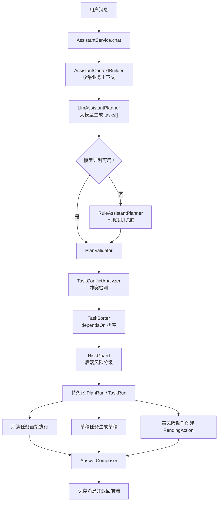

# AI 客服多步骤任务编排设计书

> 文档定位：本文保留完整架构和生产化设计思路。当前面向 Java 后端转 Agent、以 AI 学习和面试展示为目标的实际实施范围，以 `docs/AI Agent重写学习实施计划书.md` 为准；业务模块只实现验证 Agent 链路所需的最小能力。

## 1. 设计目标

本设计书针对当前 AI Shop 项目的 AI 客服模块，目标是把现有“规则意图识别 + if 分支处理”的客服逻辑，升级为：

> 大模型结构化意图规划 + 本地规则兜底 + 后端风险校验 + PendingAction 二次确认 + 状态持久化恢复。

新的简历亮点可以写成：

> 设计 AI 客服多步骤任务编排机制：基于大模型将用户自然语言解析为结构化任务计划，针对取消订单、退款、支付、改地址等高风险动作引入 PendingAction 二次确认与状态持久化机制；流程中断时不阻塞请求，通过数据库保存待确认动作和上下文，用户确认后恢复执行并重新校验订单归属、订单状态和动作有效期，避免 LLM 误判导致的越权或误操作。

这套设计不追求“让大模型直接执行工具”，而是让大模型做 Planner，让后端做 Guard 和 Executor。

### 1.1 设计审阅结论

原方案方向正确，但只使用 `PendingAssistantAction` 只能恢复一个待确认动作，不能完整表达“一个计划中多个任务的依赖、执行结果和恢复位置”。为了真正完成目标，本版增加以下约束：

1. 使用 `AssistantPlanRun` 保存一次计划实例，使用 `AssistantTaskRun` 保存每个任务的状态、依赖和结果。
2. `PendingAssistantAction` 只负责二次确认，不再承担整个工作流状态。
3. 模型返回的自然语言 `condition` 改成受限的结构化条件，后端只解释白名单中的操作符。
4. 高风险动作确认后恢复对应 `TaskRun`，成功后由编排器继续推进其下游任务。
5. 模型调用和数据库事务分离，避免等待大模型时长期占用数据库连接和事务。
6. 使用数据库唯一约束、行锁或乐观锁保证重复点击和并发确认不会重复执行。
7. 增加最小测试矩阵，所有订单写操作必须有越权、过期、状态变化和幂等测试。

完成这些调整后，本文可以作为项目重写的实施依据。第一版仍采用 Spring Service 编排，不依赖 LangGraph4j；等状态机稳定后，再决定是否把编排器替换为图引擎。

## 2. 当前项目现状

当前 AI 客服主链路在：

- `src/main/java/com/aishop/web/AssistantController.java`
- `src/main/java/com/aishop/service/AssistantService.java`
- `src/main/java/com/aishop/service/OrderService.java`
- `src/main/java/com/aishop/service/KnowledgeService.java`

当前入口：

- `POST /api/assistant/chat`
- `AssistantController.chat()`
- `AssistantService.chat()`

当前 `AssistantService.chat()` 主要流程是：

```text
获取/创建会话
-> assistantGraph.invoke()
-> detectIntent(message)
-> 收集商品、收藏、行为、订单、知识库上下文
-> executeDirectAction()
-> buildAnswer()
-> buildDraftIfNeeded()
-> buildSuggestedActions()
-> 保存 assistant_messages
-> 返回 ChatResponse
```

当前特点：

| 模块 | 当前实现 |
| --- | --- |
| 意图识别 | `detectIntent()` + 关键词/if 判断 |
| 工具编排 | `executeDirectAction()` 中手写 if 分支 |
| RAG | `KnowledgeService.search()` 做文本 + 向量检索 |
| 模型调用 | `buildAnswer()` 兜底调用 `chatModel.chat(prompt)` |
| 高风险动作 | 部分由 `canPay()`、`canCancel()` 等状态判断保护 |
| 下单 | AI 只生成草稿，用户确认后 `OrderService.confirmDraft()` 建单 |
| 转人工 | `assistant_sessions.serviceStatus = ESCALATED` |

当前不足：

1. 意图识别不是大模型做的，只是规则匹配。
2. 用户一句话包含多个任务时，缺少统一任务列表和依赖关系。
3. 高风险动作目前可以在 `executeDirectAction()` 内直接调用业务服务，缺少统一二次确认机制。
4. 没有 PendingAction 表保存“待确认动作”。
5. 用户确认动作时没有独立的恢复接口。
6. 缺少模型识别失败后的结构化兜底流程。
7. 当前 `GraphConfig` 只有一个 `start -> end` 的 passthrough 节点，`assistantGraph.invoke()` 并没有完成意图规划或工具编排。
8. `AssistantService.chat()` 标记了 `@Transactional`，模型和图调用发生在事务内，重写时需要拆开事务边界。
9. 当前项目没有 `src/test` 测试代码，高风险订单动作缺少自动化回归保护。

## 3. 新架构总览

新架构建议先不用强行引入 LangGraph4j，第一阶段用 Spring Service 做确定性编排，更容易落地、调试和讲清楚。

目标流程：

```text
用户输入
-> POST /api/assistant/chat
-> AssistantController.chat()
-> AssistantService.chat()
-> AssistantContextBuilder 收集上下文
-> LlmAssistantPlanner 调用大模型生成 AssistantPlan(tasks[])
-> RuleAssistantPlanner 在模型失败时兜底
-> PlanValidator 校验 JSON、枚举、槽位、依赖
-> TaskConflictAnalyzer 检查多任务冲突
-> TaskSorter 根据 dependsOn 拓扑排序
-> RiskGuard 后端计算风险等级
-> PlanRunService 持久化计划和任务状态
-> AssistantTaskOrchestrator 执行只读任务/草稿任务
-> PendingAssistantActionService 为高风险动作创建待确认动作
-> AnswerComposer 生成最终回答
-> 保存 assistant_messages
-> 返回 ChatResponse 扩展结果
```

用户确认待执行动作时：

```text
用户点击确认
-> POST /api/assistant/actions/{id}/confirm
-> 加载 PendingAssistantAction
-> 校验当前用户、状态、过期时间、幂等状态
-> 重新查询订单
-> 再次校验订单归属和订单状态
-> 对应 AssistantTool 调用 OrderService
-> 更新 PendingAction 状态
-> 更新对应 TaskRun 状态并恢复 PlanRun
-> 继续执行依赖已满足的下游任务，直到再次等待或计划完成
-> 写 assistant_messages 和订单时间线
-> 返回执行结果
```

核心原则：

> LLM 负责识别和规划，后端负责校验和执行。



## 4. 核心数据结构设计

### 4.1 AssistantPlan

大模型不再返回普通文本，也不是直接返回一个 `intent`，而是返回任务计划。

建议 DTO：

```java
public record AssistantPlan(
        String planType,
        List<AssistantTask> tasks,
        String summary,
        String rawModelOutput
) {}
```

`planType` 枚举：

```text
SINGLE_TASK
MULTI_TASK
CLARIFY
UNSUPPORTED
```

### 4.2 AssistantTask

```java
public record AssistantTask(
        String taskId,
        String intent,
        String action,
        String executionMode,
        Map<String, Object> slots,
        List<String> missingSlots,
        List<String> dependsOn,
        List<TaskCondition> conditions,
        Double confidence,
        String reason
) {}

public record TaskCondition(
        String sourceTaskId,
        String field,
        String operator,
        List<String> expectedValues
) {}
```

字段说明：

| 字段 | 说明 |
| --- | --- |
| `taskId` | 任务 ID，比如 `t1`、`t2` |
| `intent` | 大类意图，如 `ORDER`、`PRODUCT`、`AFTER_SALES` |
| `action` | 标准动作，如 `QUERY_ORDER`、`CANCEL_ORDER` |
| `executionMode` | 执行建议，如 `TOOL_READ`、`ASK_CONFIRM` |
| `slots` | 槽位参数，如订单号、商品关键词、新地址 |
| `missingSlots` | 缺失参数 |
| `dependsOn` | 依赖任务 ID |
| `conditions` | 结构化前置条件，只允许后端支持的字段和操作符 |
| `confidence` | 模型自评置信度，仅作为参考 |
| `reason` | 模型解释 |

条件白名单第一版只支持：

```text
field: order.status、order.shippedAt
operator: EQ、IN、IS_NULL、NOT_NULL
```

例如“如果还没发货就取消”表示为：

```json
{
  "sourceTaskId": "t1",
  "field": "order.status",
  "operator": "IN",
  "expectedValues": ["PENDING_PAYMENT", "CONFIRMED"]
}
```

`reason` 和用户原始条件只用于解释及审计，不能被当作可执行表达式，也不能使用 SpEL、脚本或动态 SQL 求值。

### 4.3 枚举设计

`AssistantIntent`：

```text
ORDER
PRODUCT
PROMOTION
AFTER_SALES
PROFILE
KNOWLEDGE
HANDOFF
CHAT
```

`AssistantAction`：

```text
QUERY_ORDER
QUERY_LOGISTICS
SEARCH_PRODUCT
SEARCH_KNOWLEDGE
CHECK_PROMOTION
CREATE_ORDER_DRAFT
CANCEL_ORDER
PAY_ORDER
REQUEST_REFUND
CONFIRM_RECEIPT
UPDATE_ADDRESS
HANDOFF
ASK_CLARIFICATION
GENERAL_CHAT
```

`ExecutionMode`：

```text
ANSWER_ONLY
TOOL_READ
CREATE_DRAFT
ASK_CONFIRM
DIRECT_EXECUTE
CLARIFY
```

`RiskLevel`：

```text
READ_ONLY
LOW
DRAFT
WRITE
PAYMENT
BLOCKED
```

注意：模型可以返回 `executionMode`，但后端必须重新计算真正风险等级。模型返回的 `riskLevel` 不应作为执行依据。

### 4.4 运行时状态

计划状态 `PlanRunStatus`：

```text
PLANNED
RUNNING
WAITING_CONFIRMATION
WAITING_INPUT
COMPLETED
PARTIALLY_COMPLETED
FAILED
CANCELLED
EXPIRED
```

任务状态 `TaskRunStatus`：

```text
PENDING
READY
RUNNING
WAITING_CONFIRMATION
WAITING_INPUT
SUCCEEDED
SKIPPED
FAILED
CANCELLED
EXPIRED
```

状态只允许通过后端定义的转换方法变化。例如：

```text
PENDING -> READY -> RUNNING -> SUCCEEDED
READY -> WAITING_CONFIRMATION -> RUNNING -> SUCCEEDED
PENDING -> SKIPPED（条件不满足）
WAITING_CONFIRMATION -> CANCELLED / EXPIRED
RUNNING -> FAILED
```

## 5. 大模型任务规划设计

### 5.1 LlmAssistantPlanner 职责

新增：

- `src/main/java/com/aishop/service/ai/LlmAssistantPlanner.java`

职责：

1. 接收用户消息和业务上下文。
2. 构造 planner prompt。
3. 调用 `ChatModel`。
4. 解析模型返回 JSON。
5. 返回 `AssistantPlan`。
6. 模型异常、超时、JSON 解析失败时返回失败结果，由本地规则兜底。

### 5.2 Planner Prompt 核心要求

Prompt 里要明确告诉模型：

```text
你是电商 AI 客服的意图规划器，不是客服回答器，也不是业务执行器。

你的任务：
1. 将用户自然语言拆解成一个或多个标准任务。
2. 只能使用后端提供的 intent 和 action 枚举。
3. 如果用户有多个目标，输出多个 tasks。
4. 如果一个任务依赖另一个任务结果，填写 dependsOn。
5. 如果参数缺失，填写 missingSlots，不要编造。
6. 如果只是咨询“怎么做”，使用 ANSWER_ONLY。
7. 如果是查询类任务，使用 TOOL_READ。
8. 如果是下单草稿，使用 CREATE_DRAFT。
9. 如果是取消订单、退款、支付、改地址、确认收货，必须使用 ASK_CONFIRM。
10. 不允许输出 DIRECT_EXECUTE 给高风险动作。
11. 条件只能使用给定的 field/operator 枚举，禁止生成代码或表达式。
12. 一次最多输出 5 个任务，无法确定时输出 ASK_CLARIFICATION。
13. 只输出 JSON，不要输出解释性文本。
```

Planner 输入只包含当前登录用户的必要上下文、最近若干轮消息和未完成计划摘要，不把完整数据库数据交给模型。系统提示、用户输入、RAG 文本和业务上下文必须使用明确分隔；知识库文本视为不可信数据，其中出现的“忽略系统提示”“调用某动作”等内容不得改变动作白名单和风险策略。

模型输出必须由 Jackson 反序列化到 DTO，再做 Bean Validation 和 `PlanValidator` 校验。禁止用正则从自然语言中截取 JSON 后直接执行。建议限制：原始输出不超过 32 KB、任务数不超过 5、每个槽位文本不超过 512 字符、规划调用设置超时。

### 5.3 模型输出示例

用户：

```text
帮我查一下订单 ORD-12345678 的物流，如果还没发货就取消
```

模型输出：

```json
{
  "planType": "MULTI_TASK",
  "tasks": [
    {
      "taskId": "t1",
      "intent": "ORDER",
      "action": "QUERY_LOGISTICS",
      "executionMode": "TOOL_READ",
      "slots": {
        "orderNo": "ORD-12345678"
      },
      "missingSlots": [],
      "dependsOn": [],
      "conditions": [],
      "confidence": 0.92,
      "reason": "用户明确要求查询订单物流"
    },
    {
      "taskId": "t2",
      "intent": "ORDER",
      "action": "CANCEL_ORDER",
      "executionMode": "ASK_CONFIRM",
      "slots": {
        "orderNo": "ORD-12345678"
      },
      "missingSlots": [],
      "dependsOn": ["t1"],
      "conditions": [
        {
          "sourceTaskId": "t1",
          "field": "order.status",
          "operator": "IN",
          "expectedValues": ["PENDING_PAYMENT", "CONFIRMED"]
        }
      ],
      "confidence": 0.88,
      "reason": "用户要求在未发货时取消订单"
    }
  ],
  "summary": "用户想先查询物流，如果订单未发货则取消订单"
}
```

### 5.4 置信度处理

模型返回的 `confidence` 只是模型自评，不是真实概率，不能用一个未经离线标定的加权公式把它包装成“真实置信度”。第一版采用硬校验优先的决策：

| 情况 | 处理 |
| --- | --- |
| JSON、枚举、依赖不合法 | 拒绝模型计划，进入规则兜底 |
| action 与本地高风险关键词明显冲突 | 不执行，追问用户 |
| 必填槽位缺失或目标不唯一 | `WAITING_INPUT`，明确追问 |
| 只读任务结构合法且目标属于当前用户 | 可以执行 |
| 任意写操作或支付动作 | 无论模型分数多高都必须确认 |

如果为了观测保留综合值，字段应命名为 `decisionScore`，它只是路由启发值，不是概率。模型自评分、规则一致性、槽位完整度分别落库，后续使用人工标注数据评估准确率后再校准阈值。

### 5.5 真实模型与本地模式

当前真正被 `AiModelConfig` 读取的是 `shop.ai.*` 配置，而不是文档上容易误解的 `langchain4j.open-ai.*` 自动配置。重写时应只保留一套配置来源：

```text
SHOP_AI_ENABLED=true
OPENAI_API_KEY=真实 DashScope Key
shop.ai.base-url=https://dashscope.aliyuncs.com/compatible-mode/v1
shop.ai.model-name=qwen-plus
```

`LocalChatModelConfig` 返回的是本地回显模型，不具备真正语义规划能力。`PlannerFacade` 应先检查 `aiEnabled && apiKeyConfigured`：满足时调用 `LlmAssistantPlanner`，否则直接调用 `RuleAssistantPlanner`，并将 `planner_source` 标为 `RULE_FALLBACK`。不能把本地回显结果解析失败后再包装成“大模型规划成功”。

生产环境默认关闭 `logRequests/logResponses`，因为规划提示中可能包含订单号、地址和会话内容。日志只记录 traceId、模型名、耗时、token 用量、plannerSource、校验结果和错误类型，不记录 API Key，也不默认记录完整提示词。

### 5.6 Function Calling 的边界

如果 DashScope 当前模型和 LangChain4j 版本对 OpenAI-compatible tool calling 支持稳定，Planner 可以只向模型暴露一个无业务副作用的函数：

```text
submit_assistant_plan(planType, tasks, summary)
```

模型调用它只是提交结构化计划，后端接收参数后仍要经过 `PlanValidator -> ConflictAnalyzer -> RiskGuard`。不要直接把 `OrderService.cancelOrder()`、`payOrder()` 等方法标成可由模型自动执行的 `@Tool`，也不要把业务 Tool 列表交给会自动循环执行工具的 Agent。

如果模型未返回 `submit_assistant_plan`，或者供应商对嵌套参数 schema 支持不稳定，则退回“严格 JSON + Jackson 解析”。这两种方式改变的是结构化输出通道，不改变安全架构。面试时只有实际使用了原生 tool call 协议，才能写“基于 Function Calling 提交任务计划”；否则应准确表述为“LLM 结构化规划 + 后端工具注册表”。

## 6. 本地规则兜底设计

当前 `AssistantService.detectIntent()`、`isPaymentIntent()`、`isRefundIntent()`、`wantsDirectExecution()` 等逻辑不要删除，应该迁移为：

- `RuleAssistantPlanner`

职责：

1. 模型不可用时生成基础 `AssistantPlan`。
2. 模型输出低可信时辅助判断。
3. 高风险动作执行前做 guard 复核。

触发兜底的场景：

```text
模型未配置
模型请求异常
模型超时
模型返回非 JSON
JSON 缺少 tasks
action 不在白名单
confidence 太低
模型计划与本地规则明显冲突
```

兜底计划示例：

```json
{
  "planType": "SINGLE_TASK",
  "tasks": [
    {
      "taskId": "t1",
      "intent": "ORDER",
      "action": "QUERY_ORDER",
      "executionMode": "TOOL_READ",
      "slots": {},
      "missingSlots": [],
      "dependsOn": [],
      "confidence": 0.70,
      "reason": "本地规则识别为订单查询"
    }
  ],
  "summary": "本地规则兜底识别"
}
```

## 7. PlanValidator 设计

新增：

- `PlanValidator`

校验项：

1. `planType` 是否合法。
2. `tasks` 是否为空。
3. `taskId` 是否唯一。
4. `intent` 是否在后端枚举中。
5. `action` 是否在后端白名单中。
6. `executionMode` 是否合法。
7. `dependsOn` 引用的任务是否存在。
8. 是否存在依赖循环。
9. 每个 action 所需 slots 是否齐全。
10. 是否出现禁止模型直接执行的动作。

动作白名单必须由后端定义。

示例策略：

```java
EnumSet<AssistantAction> allowedActions = EnumSet.of(
    QUERY_ORDER,
    QUERY_LOGISTICS,
    SEARCH_PRODUCT,
    SEARCH_KNOWLEDGE,
    CHECK_PROMOTION,
    CREATE_ORDER_DRAFT,
    CANCEL_ORDER,
    PAY_ORDER,
    REQUEST_REFUND,
    CONFIRM_RECEIPT,
    UPDATE_ADDRESS,
    HANDOFF,
    ASK_CLARIFICATION,
    GENERAL_CHAT
);
```

## 8. 多任务冲突检测设计

新增：

- `TaskConflictAnalyzer`

模型可以拆任务，但不能决定任务是否冲突。冲突检测必须由后端规则完成。

### 8.1 冲突类型

#### 8.1.1 互斥动作冲突

同一个订单上不能同时做：

```text
CANCEL_ORDER + PAY_ORDER
CANCEL_ORDER + UPDATE_ADDRESS
CANCEL_ORDER + CONFIRM_RECEIPT
CANCEL_ORDER + REQUEST_REFUND
PAY_ORDER + REQUEST_REFUND
```

处理方式：

```text
不执行冲突任务
返回追问：你是想取消订单，还是继续支付？
```

#### 8.1.2 同资源写写冲突

例如：

```text
把订单地址改成上海，再改成北京
```

两个任务都写：

```text
orders:{orderId}.shippingAddress
```

处理方式：

```text
追问用户最终想改成哪个地址
```

#### 8.1.3 状态前置条件冲突

例如：

```text
确认收货并退款
```

这两个动作存在顺序和状态变化，不能自动串行执行。应拆成单独确认。

#### 8.1.4 条件动作缺少依赖

如果任务有：

```text
conditions 包含 order.status IN [PENDING_PAYMENT, CONFIRMED]
```

但没有依赖 `QUERY_ORDER` 或 `QUERY_LOGISTICS`，后端应自动补充只读查询任务，或要求模型兜底重规划。

### 8.2 动作资源模型

每个 action 定义读写资源：

| action | 读资源 | 写资源 |
| --- | --- | --- |
| `QUERY_ORDER` | `orders:{orderId}` | 无 |
| `QUERY_LOGISTICS` | `orders:{orderId}`、`order_timeline_events:{orderId}` | 无 |
| `CANCEL_ORDER` | `orders:{orderId}` | `orders:{orderId}.status` |
| `PAY_ORDER` | `orders:{orderId}` | `orders:{orderId}.status`、`orders:{orderId}.payment` |
| `UPDATE_ADDRESS` | `orders:{orderId}` | `orders:{orderId}.shippingAddress` |
| `REQUEST_REFUND` | `orders:{orderId}` | `orders:{orderId}.status`、`after_sales_cases:{orderId}` |
| `CREATE_ORDER_DRAFT` | `products:{productId}` | `pending_order_drafts:{threadId}` |

冲突检测可以基于：

```text
同目标资源 + 写写冲突
同目标资源 + 互斥动作
高风险动作组合
```

## 9. dependsOn 排序设计

新增：

- `TaskSorter`

对 `tasks[]` 做拓扑排序。

规则：

1. `dependsOn` 里的任务必须存在。
2. 不允许循环依赖。
3. 没有依赖的只读任务可以先执行。
4. 高风险任务即使排好序，也只创建 PendingAction，不直接执行。

伪代码：

```java
List<AssistantTask> sort(List<AssistantTask> tasks) {
    Map<String, AssistantTask> taskMap = toTaskMap(tasks);
    Map<String, Integer> indegree = initIndegree(tasks);
    Map<String, List<String>> graph = buildGraph(tasks);

    Queue<String> queue = new ArrayDeque<>();
    for (String taskId : taskMap.keySet()) {
        if (indegree.get(taskId) == 0) {
            queue.add(taskId);
        }
    }

    List<AssistantTask> sorted = new ArrayList<>();
    while (!queue.isEmpty()) {
        String current = queue.poll();
        sorted.add(taskMap.get(current));
        for (String next : graph.get(current)) {
            indegree.put(next, indegree.get(next) - 1);
            if (indegree.get(next) == 0) {
                queue.add(next);
            }
        }
    }

    if (sorted.size() != tasks.size()) {
        throw new InvalidPlanException("任务依赖存在循环");
    }
    return sorted;
}
```

## 10. 风险等级与 PendingAction 设计

### 10.1 风险策略表

新增：

- `ActionRiskPolicy`
- `RiskGuard`

后端维护动作风险策略表：

| action | riskLevel | 是否需要确认 | 说明 |
| --- | --- | --- | --- |
| `QUERY_ORDER` | `READ_ONLY` | 否 | 只读查询 |
| `QUERY_LOGISTICS` | `READ_ONLY` | 否 | 只读查询 |
| `SEARCH_PRODUCT` | `READ_ONLY` | 否 | 只读查询 |
| `SEARCH_KNOWLEDGE` | `READ_ONLY` | 否 | 只读查询 |
| `CHECK_PROMOTION` | `READ_ONLY` | 否 | 只读查询 |
| `CREATE_ORDER_DRAFT` | `DRAFT` | 否 | 只生成草稿 |
| `HANDOFF` | `LOW` | 否 | 转人工 |
| `CANCEL_ORDER` | `WRITE` | 是 | 修改订单状态 |
| `REQUEST_REFUND` | `WRITE` | 是 | 触发售后流程 |
| `UPDATE_ADDRESS` | `WRITE` | 是 | 修改收货信息 |
| `CONFIRM_RECEIPT` | `WRITE` | 是 | 订单进入完成状态 |
| `PAY_ORDER` | `PAYMENT` | 是，强确认 | 涉及支付 |

注意：

> 风险等级只看后端策略，不相信模型返回。

### 10.2 AssistantPlanRun 与 AssistantTaskRun

`AssistantPlan` 是模型输出 DTO，`AssistantPlanRun` 才是数据库中的一次运行实例。建议新增三张表，而不是只增加 PendingAction 表。

`assistant_plan_runs`：

| 字段 | 类型 | 说明 |
| --- | --- | --- |
| `id` | Long | 计划实例主键 |
| `user_id` | FK | 当前用户，服务端写入 |
| `session_id` | FK | AI 会话，服务端写入 |
| `thread_id` | varchar(64) | 前端线程标识，仅用于关联展示 |
| `client_message_id` | varchar(64) | 本次聊天请求幂等键 |
| `status` | varchar(32) | `PlanRunStatus` |
| `plan_type` | varchar(32) | 单任务、多任务、追问等 |
| `user_message` | varchar(4000) | 触发规划的原始消息 |
| `plan_json` | TEXT | 校验后的计划快照 |
| `planner_source` | varchar(32) | `LLM` 或 `RULE_FALLBACK` |
| `model_name` | varchar(128) | 实际模型名称，便于审计 |
| `failure_reason` | varchar(1024) | 失败原因 |
| `version` | Long | 乐观锁版本 |
| `created_at/updated_at` | timestamp | 审计时间 |

`assistant_task_runs`：

| 字段 | 类型 | 说明 |
| --- | --- | --- |
| `id` | Long | 任务实例主键 |
| `plan_run_id` | FK | 所属计划 |
| `task_key` | varchar(64) | 模型任务 ID，如 `t1` |
| `sequence_no` | int | 拓扑排序后的稳定顺序 |
| `intent/action` | varchar(64) | 标准意图和动作 |
| `execution_mode/risk_level` | varchar(32) | 后端最终决策 |
| `status` | varchar(32) | `TaskRunStatus` |
| `slots_json` | TEXT | 校验、归一化后的槽位 |
| `missing_slots_json` | TEXT | 缺失槽位 |
| `depends_on_json` | TEXT | 依赖任务 key |
| `conditions_json` | TEXT | 结构化条件 |
| `result_json` | TEXT | 工具执行结果快照 |
| `failure_reason` | varchar(1024) | 失败原因 |
| `started_at/completed_at` | timestamp | 执行时间 |
| `version` | Long | 乐观锁版本 |
| `created_at/updated_at` | timestamp | 审计时间 |

必须增加唯一约束：

```text
unique(session_id, client_message_id)
unique(plan_run_id, task_key)
```

依赖关系第一版可以保存在 `depends_on_json`，由应用层拓扑排序；如果以后需要大量 SQL 查询依赖边，再拆成 `assistant_task_dependencies` 表。

### 10.3 PendingAssistantAction 实体

新增实体：

- `src/main/java/com/aishop/domain/PendingAssistantAction.java`

表名：

- `pending_assistant_actions`

字段建议：

| 字段 | 类型 | 说明 |
| --- | --- | --- |
| `id` | Long | 主键 |
| `user_id` | FK | 用户 |
| `session_id` | FK | AI 会话 |
| `thread_id` | varchar(64) | 会话线程 |
| `task_run_id` | FK + unique | 对应的任务运行实例 |
| `intent` | varchar(64) | 意图 |
| `action` | varchar(64) | 动作 |
| `risk_level` | varchar(32) | 后端计算风险 |
| `status` | varchar(32) | 状态 |
| `target_type` | varchar(64) | 目标类型，如 `ORDER` |
| `target_id` | Long | 目标 ID |
| `target_ref` | varchar(128) | 目标引用，如订单号 |
| `payload_json` | TEXT | 执行参数 |
| `plan_snapshot_json` | TEXT | 当时模型计划快照 |
| `llm_confidence` | decimal | 模型自评 |
| `decision_score` | decimal | 可选启发分，不代表概率 |
| `llm_reason` | varchar(1024) | 模型原因 |
| `confirm_request_id` | varchar(64) unique | 前端确认幂等键 |
| `expires_at` | timestamp | 过期时间 |
| `confirmed_at` | timestamp | 用户确认时间 |
| `executed_at` | timestamp | 执行时间 |
| `failure_reason` | varchar(1024) | 失败原因 |
| `result_json` | TEXT | 成功结果，用于幂等重放响应 |
| `version` | Long | 乐观锁版本 |
| `created_at` | timestamp | 创建时间 |
| `updated_at` | timestamp | 更新时间 |

状态：

```text
PENDING_CONFIRMATION
CONFIRMED
EXECUTING
EXECUTED
CANCELLED
EXPIRED
FAILED
```

`payload_json` 只能保存经过后端白名单校验和归一化的参数。执行时仍以重新查询到的业务数据为准，不能把模型传来的 `targetId`、订单归属或订单状态当成事实。

### 10.4 三类数据各自负责什么

| 数据 | 作用 |
| --- | --- |
| `AssistantPlanRun` | 一次用户请求产生的整份工作流及总体状态 |
| `AssistantTaskRun` | 每个任务的依赖、条件、执行状态和结果 |
| `PendingAssistantAction` | 某个高风险任务的确认期限、确认幂等和审计 |

恢复时先通过 PendingAction 找到 TaskRun，再找到 PlanRun。动作成功后把 TaskRun 标记为 `SUCCEEDED`，编排器扫描同一 PlanRun 中依赖已全部成功的任务继续执行。

### 10.5 为什么需要状态持久化

用户确认是跨请求的，后端不能阻塞等待。

错误方式：

```text
HTTP 请求中等待用户点击确认
```

正确方式：

```text
创建 PendingAction
-> 当前请求结束
-> 前端展示确认按钮
-> 用户确认时发新请求
-> 后端加载 PendingAction、TaskRun 和 PlanRun 恢复流程
```

数据库结构不要继续只依赖 `hibernate.ddl-auto=update` 演进。重写阶段建议引入 Flyway，为 PostgreSQL 编写版本化迁移；测试环境可用 PostgreSQL Testcontainers，避免 H2 与 PostgreSQL 在 JSON、锁和索引行为上的差异掩盖问题。

## 11. API 设计

### 11.0 ChatRequest 扩展

聊天请求也可能因为双击或网络重试重复到达。建议增加客户端消息 ID：

```java
public record ChatRequest(
    Long sessionId,
    String message,
    String threadId,
    String clientMessageId
) {}
```

同一 `sessionId + clientMessageId` 再次请求时直接返回原计划结果，不能重复创建 PendingAction。

### 11.1 ChatResponse 扩展

当前 `ChatResponse`：

```java
public record ChatResponse(
    Long sessionId,
    String answer,
    String intent,
    String threadId,
    List<KnowledgeSourceResponse> sources,
    String pendingOrderDraft,
    List<SuggestedActionResponse> suggestedActions
) {}
```

建议扩展：

```java
public record ChatResponse(
    Long sessionId,
    String answer,
    String intent,
    String threadId,
    List<KnowledgeSourceResponse> sources,
    String pendingOrderDraft,
    List<SuggestedActionResponse> suggestedActions,
    List<PendingAssistantActionResponse> pendingActions,
    Long planRunId,
    String planStatus,
    AssistantPlanResponse plan
) {}
```

`pendingActions` 用于前端展示确认按钮。

`plan` 可选，用于开发调试和面试演示。生产环境可以隐藏。

### 11.2 PendingAction 接口

新增 Controller：

- `AssistantActionController`

接口：

```text
GET    /api/assistant/sessions/{sessionId}/actions/pending
POST   /api/assistant/actions/{id}/confirm
POST   /api/assistant/actions/{id}/cancel
```

服务端必须从登录会话获得 `userId`，通过 `actionId + userId` 查询动作；不能仅依赖客户端提交的 `threadId`、`sessionId` 或 `targetId` 做授权。

确认请求：

```json
{
  "clientRequestId": "uuid-for-idempotency"
}
```

`confirmText` 可以用于界面展示，但不是安全凭证。是否确认以登录用户对具体 action ID 发起的确认请求为准。

返回：

```json
{
  "actionId": 1001,
  "planRunId": 501,
  "status": "EXECUTED",
  "planStatus": "COMPLETED",
  "answer": "已帮你取消订单 ORD-12345678，当前状态为已取消。",
  "order": {}
}
```

## 12. 用户确认后的恢复流程

确认接口流程：

```text
1. 在事务中根据 `actionId + 当前用户` 加行锁查询 PendingAssistantAction
2. 校验 user_id 是否等于当前登录用户
3. 校验 status 是否为 PENDING_CONFIRMATION
4. 校验 expires_at 是否未过期
5. 校验或记录唯一 `clientRequestId`
6. 将 PendingAction 和对应 TaskRun 更新为 EXECUTING
7. 根据 action 加锁或带版本号重新加载目标资源
8. 再次校验订单归属、订单状态和结构化前置条件
9. 调用对应 AssistantTool/OrderService 方法
10. 同一事务更新 PendingAction 为 EXECUTED、TaskRun 为 SUCCEEDED，并保存 result_json，然后提交事务
11. 事务提交后调用 `taskOrchestrator.resume(planRunId)`，推进依赖已满足的任务
12. 更新 PlanRun 为 WAITING_CONFIRMATION、WAITING_INPUT、COMPLETED 或 PARTIALLY_COMPLETED
13. 写入 assistant_messages 和订单时间线
14. 返回本次动作和计划的最新结果
```

如果过期：

```text
status -> EXPIRED
返回：这个确认操作已经过期，请重新发起。
```

如果订单状态变化：

```text
status -> FAILED
返回：订单当前已发货，不能直接取消，我可以帮你申请售后或转人工。
```

如果重复点击：

```text
相同 clientRequestId：返回 result_json 中的原执行结果
不同 clientRequestId 但状态已 EXECUTED：仍返回原结果，不再次调用业务服务
```

### 12.1 多步骤条件推进示例

```text
t1 QUERY_LOGISTICS：READY -> RUNNING -> SUCCEEDED
-> result_json 保存 order.status=CONFIRMED
-> 编排器发现 t2 依赖 t1 且条件满足
t2 CANCEL_ORDER：READY -> WAITING_CONFIRMATION
-> 当前 HTTP 请求结束
-> 用户确认后 t2 -> RUNNING -> SUCCEEDED
-> 编排器再次扫描，没有后续任务
PlanRun -> COMPLETED
```

如果 t1 返回 `SHIPPED`，则 t2 条件不满足，状态改为 `SKIPPED`，不会创建 PendingAction，PlanRun 可以完成并向用户说明“订单已发货，因此没有执行取消”。

### 12.2 缺少槽位后的恢复

当模型识别到 `CANCEL_ORDER` 但用户有多个可取消订单且没有指定订单号时：

```text
TaskRun -> WAITING_INPUT
PlanRun -> WAITING_INPUT
assistant 回复可选订单并询问订单号
```

用户下一条消息到达时，先查询该会话是否只有一个 `WAITING_INPUT` 计划：

1. 如果用户是在补充所需槽位，把新值合并到原 TaskRun，重新做槽位、归属和冲突校验，然后调用 `resume(planRunId)`。
2. 如果用户表达了无关的新目标，创建新的 PlanRun，原计划继续保留到过期或由用户取消。
3. 如果同一会话有多个待补充计划，必须追问用户要继续哪一个，不能猜测。

槽位合并只能更新 `missingSlots` 中声明的字段，禁止模型借补参机会修改已确认的 action、userId、targetId 或风险等级。

### 12.3 事务与并发边界

不能让 `AssistantService.chat()` 的一个 `@Transactional` 包住数据库查询、大模型网络调用和全部工具执行。建议拆为：

```text
短只读事务：加载会话和必要业务上下文
无数据库事务：调用 LLM 并解析计划
短写事务：持久化 PlanRun / TaskRun
每个任务独立事务：执行工具并写结果
确认独立事务：锁 PendingAction + 重验业务数据 + 执行动作 + 写状态
```

实体增加 `@Version`。确认查询可使用 `PESSIMISTIC_WRITE` 锁住 PendingAction；订单写操作也应使用乐观锁或行锁，防止确认瞬间管理员或其他请求已改变订单状态。

对于当前项目中完全落在同一 PostgreSQL 事务内的订单状态更新，可以做到原子提交。若以后接真实支付、物流或退款第三方接口，不能宣称数据库事务提供 exactly-once；应使用第三方幂等键、Outbox/事件表和回调对账。当前 `OrderService.payOrder()` 是演示性直接改状态，真实版本的 `PAY_ORDER` 应创建支付单并返回支付入口，由支付回调确认成功，而不是让 AI 直接把订单标记为已支付。

两个相同 `clientMessageId` 的聊天请求可能同时完成 LLM 调用。数据库唯一约束是最终防线：后写入者捕获唯一键冲突后加载先写入的 PlanRun 并返回，不能再次执行编排器。

## 13. 与当前代码的改造映射

### 13.1 AssistantService.chat()

当前 `chat()` 里有大量逻辑：

```text
detectIntent()
executeDirectAction()
buildAnswer()
buildDraftIfNeeded()
buildSuggestedActions()
```

建议让 Controller 调用不带大事务的应用服务：

```java
public ChatResponse chat(AppUser user, ChatCommand command) {
    ChatResponse replay = planRunService.findReplay(
            user, command.sessionId(), command.clientMessageId());
    if (replay != null) {
        return replay;
    }

    AssistantSession session = sessionService.getOrCreate(user, command.sessionId());
    String currentThreadId = resolveThreadId(session, command.threadId());

    AssistantContext context = contextBuilder.build(
            user, session, command.message(), currentThreadId);

    AssistantPlan plan = plannerFacade.plan(user, session, command.message(), context);
    ValidatedPlan validatedPlan = planValidator.validateOrFallback(
            plan, command.message(), context);
    ConflictAnalysis conflictAnalysis = conflictAnalyzer.analyze(validatedPlan);

    if (conflictAnalysis.hasBlockingConflict()) {
        return answerComposer.conflictAnswer(...);
    }

    AssistantPlanRun run = planRunService.create(
            user, session, command, validatedPlan, taskSorter.sort(validatedPlan.tasks()));
    OrchestrationResult result = taskOrchestrator.start(run.getId());

    return answerComposer.toChatResponse(session, currentThreadId, run, result);
}
```

### 13.2 executeDirectAction()

当前 `executeDirectAction()` 中直接调用：

```text
orderService.payOrder()
orderService.cancelOrder()
orderService.confirmReceipt()
orderService.requestRefund()
orderService.updateShippingAddress()
```

新设计中：

1. 只读动作仍可直接执行。
2. 高风险动作不在 `chat()` 请求中直接执行。
3. 高风险动作改为创建 `PendingAssistantAction`。
4. 真正执行迁移到 `PendingAssistantActionService.confirm()` 和对应 `AssistantTool`。

旧方法在迁移期间可以被特性开关保护，但最终必须删除其直接写订单的路径。本地兜底只负责生成规则计划，不能继续绕过 PendingAction 直接执行。

### 13.3 buildAnswer()

当前 `buildAnswer()` 里的规则回答仍有价值。

新设计中拆成：

- `AnswerComposer`
- `RuleAnswerService`
- `ModelAnswerService`

规则回答继续优先处理确定性问题；开放问题再调用模型。

### 13.4 buildDraftIfNeeded()

下单草稿逻辑保留，但触发方式从：

```text
intent == order && isPurchaseIntent(message)
```

改为：

```text
AssistantTask.action == CREATE_ORDER_DRAFT
```

然后继续调用：

- `OrderService.buildDraft()`

### 13.5 SuggestedActions

`buildSuggestedActions()` 仍保留，但新增：

```text
pendingActions -> 前端确认按钮
suggestedActions -> 普通下一步引导按钮
```

二者区别：

| 类型 | 作用 |
| --- | --- |
| `suggestedActions` | 再发一条 prompt，引导继续问 |
| `pendingActions` | 确认一个已生成的待执行动作 |

### 13.6 工具注册表

为了避免把新的编排器再次写成大型 `if/switch`，每个动作由注册表分发到确定性工具：

```java
public interface AssistantTool {
    AssistantAction action();
    PreparedToolCall prepare(ToolContext context, Map<String, Object> slots);
    ToolResult execute(ToolContext context, PreparedToolCall call);
}
```

`prepare()` 只做参数归一化、目标解析、权限和当前状态预检，不产生业务副作用。`execute()` 才调用 `OrderService`、`KnowledgeService`、`ProductService` 等服务。`AssistantToolRegistry` 在启动时将 `action -> tool` 建成不可变 Map，发现重复 action 或缺少 handler 时启动失败。

风险等级、是否确认和允许的槽位不由 Tool 自由决定，而由集中式 `ActionPolicyRegistry` 定义。Orchestrator 的固定顺序是：

```text
PlanValidator -> ActionPolicyRegistry -> tool.prepare()
-> 只读：tool.execute()
-> 高风险：保存 PreparedToolCall 到 PendingAction，等待确认后 tool.execute()
```

第一版不需要为 14 个动作各建一个类，可以按稳定业务边界拆成 `OrderAssistantTool`、`ProductAssistantTool`、`KnowledgeAssistantTool`、`PromotionAssistantTool` 和 `HandoffAssistantTool`，注册表的 key 仍是具体 action。

### 13.7 建议目录

```text
com.aishop.assistant
├── application     AssistantApplicationService、AssistantActionService
├── model           AssistantPlan、AssistantTask、枚举、运行结果
├── planner         LlmAssistantPlanner、RuleAssistantPlanner、PlannerFacade
├── validation      PlanValidator、TaskConflictAnalyzer、TaskSorter、RiskGuard
├── orchestration   AssistantTaskOrchestrator、ConditionEvaluator
├── tool            AssistantTool、AssistantToolRegistry、各业务 Tool
└── response        AnswerComposer

com.aishop.domain   AssistantPlanRun、AssistantTaskRun、PendingAssistantAction
com.aishop.repository 对应 Repository
com.aishop.web      AssistantController、AssistantActionController
```

这是重写后的目标结构。不要在第一步一次性移动现有所有类；先建立新链路并通过测试，再删除 `AssistantService` 中的旧分支。

## 14. 前端改造

当前前端 AI 客服在：

- `src/main/resources/static/scripts/client-app.js`

需要新增：

1. 渲染 `pendingActions`。
2. 显示过期时间。
3. 提供确认/取消按钮。
4. 点击确认调用 `/api/assistant/actions/{id}/confirm`。
5. 点击取消调用 `/api/assistant/actions/{id}/cancel`。
6. 执行后刷新订单列表、会话消息、pending actions。

前端展示示例：

```text
我理解你想取消订单 ORD-12345678。该订单当前状态为待发货，可以取消。
取消订单会改变订单状态，请确认是否继续。

[确认取消订单] [放弃]
有效期：5 分钟
```

用户输入“确认”时也可以支持：

```text
如果当前会话只有一个未过期 PendingAction，则直接进入确认流程。
如果有多个，则追问用户确认哪一个。
```

文本“确认”不能让模型直接调用写工具。后端必须先确定唯一 PendingAction，再复用与确认按钮完全相同的 `confirm(actionId, clientRequestId)` 服务；第一版优先只实现按钮确认，减少歧义。

## 15. 超时设计

PendingAction 必须过期。

建议默认：

```text
WRITE 动作：10 分钟
PAYMENT 动作：5 分钟
地址修改：10 分钟
WAITING_INPUT 计划：24 小时
```

必须实现懒加载过期：

```java
if (action.expiresAt().isBefore(now)) {
    action.setStatus(EXPIRED);
    taskRun.setStatus(EXPIRED);
    planRun.recalculateStatus();
    return expiredAnswer();
}
```

可选增加定时任务：

```text
每分钟扫描 PENDING_CONFIRMATION 且 expires_at < now 的记录
批量标记为 EXPIRED
```

定时任务只是清理和改善展示，安全判断必须仍在确认事务中完成，不能依赖定时任务“及时跑到”。计划过期后保留审计记录，不物理删除。

## 16. 安全与越权防护

新设计必须坚持这些规则：

1. 模型输出永远不直接执行。
2. action 必须在后端白名单。
3. riskLevel 由后端计算。
4. 高风险动作必须 PendingAction。
5. PendingAction 必须绑定 `user_id`、`session_id`、`thread_id`。
6. 确认时必须重新校验当前登录用户。
7. 订单动作必须重新查订单并校验归属。
8. 订单动作必须重新校验状态。
9. PendingAction 必须有过期时间。
10. PendingAction 必须幂等，不能重复执行。
11. 执行结果必须写审计信息和消息记录。
12. `threadId`、订单号、targetId、slots 和模型输出全部视为不可信输入。
13. RAG 文本只能作为回答资料，不能提升权限、扩展 action 白名单或覆盖系统策略。
14. 规划上下文最小化，只发送完成当前任务必要的用户数据，地址等敏感字段默认脱敏。
15. Session Cookie 下的写接口需要同源限制和 CSRF 防护，不能只依赖前端隐藏按钮。
16. 对 chat、confirm 和模型调用做用户级限流，防止重复请求和模型费用滥用。
17. API Key 只从环境变量读取，日志和返回值中不得出现；生产关闭完整模型请求/响应日志。
18. Planner 最多输出 5 个任务，字符串和 JSON 大小设上限，避免异常计划消耗资源。

确认接口的授权查询建议直接表达为：

```java
pendingActionRepository.findForUpdateByIdAndUserId(actionId, currentUserId)
```

订单查询也使用 `orderId + currentUserId`，不要先按全局订单号查出订单再单独比较。即使模型或前端拿到了别人的订单 ID，数据库查询也应返回“资源不存在或不可操作”。

## 17. 分阶段落地计划

### 第零阶段：建立安全基线

目标：

- 为现有 `OrderService` 的取消、退款、确认收货、支付、改地址补集成测试。
- 给旧 `executeDirectAction()` 增加特性开关，默认禁止 AI 直接执行订单写操作。
- 记录当前聊天、RAG、草稿和人工客服功能的基线行为。
- 明确 `shop.ai.*` 是唯一模型配置，区分真实模型与本地规则模式。

验收：

- 关闭新功能时原有查询和回答仍可用。
- AI 消息不能绕过确认直接修改订单。
- 测试能证明用户不能操作他人订单。

### 第一阶段：数据库与运行时骨架

目标：

- 引入 Flyway，创建 `assistant_plan_runs`、`assistant_task_runs`、`pending_assistant_actions`。
- 新增状态枚举、JPA 实体、Repository、唯一约束和 `@Version`。
- 实现合法状态转换，不接大模型、不执行工具。
- 增加 ChatRequest 的 `clientMessageId` 幂等。

验收：

- 可以创建并查询一份含多个 TaskRun 的计划。
- 非法状态转换被拒绝。
- 相同 clientMessageId 只能产生一个 PlanRun。

### 第二阶段：结构化规划，先以影子模式运行

目标：

- 新增 `AssistantPlan`、`AssistantTask`、`TaskCondition`。
- 实现 `LlmAssistantPlanner`、`RuleAssistantPlanner` 和 `PlannerFacade`。
- 新增 `PlanValidator`
- 新增 `TaskConflictAnalyzer`
- 新增 `TaskSorter`
- 模型计划只落日志和 PlanRun，不影响当前用户回答和订单状态。

验收：

- 真模型可稳定输出并解析结构化 JSON。
- 模型超时、非 JSON、未知 action、循环依赖时走规则兜底或追问。
- “查物流，如果没发货就取消”能拆成两个任务。
- “取消订单然后支付”能识别冲突并追问。
- 用固定测试语料统计 intent/action/slots 准确率，确认达到可接受水平后再退出影子模式。

### 第三阶段：只读工具与编排器

目标：

- 实现 `AssistantToolRegistry`、`ActionPolicyRegistry`、`ConditionEvaluator`。
- 实现 `AssistantTaskOrchestrator.start/resume`。
- 先接入 `QUERY_ORDER`、`QUERY_LOGISTICS`、`SEARCH_PRODUCT`、`SEARCH_KNOWLEDGE`、`CHECK_PROMOTION`。
- 实现依赖满足、条件不满足跳过、结果持久化和 AnswerComposer。

验收：

- 多个只读任务按拓扑顺序执行并保存结果。
- 条件为 false 的任务标记为 SKIPPED。
- 只读工具异常不会让已完成任务丢失。

### 第四阶段：PendingAction 与单个高风险动作

目标：

- 新增确认/取消/查询 PendingAction API。
- 先接入 `CANCEL_ORDER`，确认链路稳定后再接退款、改地址、确认收货。
- 前端渲染确认卡片、过期时间和执行结果。
- 实现过期判断。
- 实现行锁/乐观锁、clientRequestId 和结果重放。

验收：

- 取消订单在聊天请求内只创建 PendingAction。
- 用户确认后才调用 `OrderService.cancelOrder()`。
- PendingAction 过期后不能执行。
- 订单状态变化后不能误执行。
- 重复确认不会重复取消订单。

### 第五阶段：多步骤恢复与补参

目标：

- 确认成功后自动 `resume(planRunId)` 推进下游任务。
- 实现 `WAITING_INPUT` 槽位补充和计划恢复。
- 实现计划取消、计划过期、部分成功和失败说明。
- 接入 `CREATE_ORDER_DRAFT` 和其现有确认链路。

验收：

- “查物流，如果未发货则取消”可以在确认后完整结束计划。
- 缺订单号时能追问并在下一条消息继续原计划。
- 服务重启后仍能从数据库恢复等待状态。

### 第六阶段：支付、观测与收尾

目标：

- 明确 `PAY_ORDER` 是演示支付还是真实支付；真实支付改为支付单 + 回调。
- 增加规划成功率、规则兜底率、追问率、PendingAction 确认率、失败率和模型延迟指标。
- 管理端查看计划、任务和 PendingAction 审计信息。
- 删除旧 `detectIntent()` 路由和 `executeDirectAction()` 直接写路径。
- 评估是否仍需当前 passthrough LangGraph4j 依赖。

验收：

- 新旧链路不再并存执行同一动作。
- 关键指标、审计记录和错误日志可定位一次完整请求。
- README、AI 全链路文档和简历描述与实际代码一致。

## 18. 测试与验收矩阵

CI 中使用 Stub/Fake ChatModel 返回固定 JSON，不依赖真实 API。真实模型使用单独的离线评测语料，不把不稳定网络结果当单元测试。

| 分类 | 必测场景 |
| --- | --- |
| Planner | 单任务、多任务、槽位缺失、模型超时、非 JSON、未知 action、超过 5 个任务 |
| Validator | 重复 taskId、依赖不存在、循环依赖、非法条件字段/操作符、写动作声明 DIRECT_EXECUTE |
| Conflict | 同订单取消+支付、取消+改地址、两次不同地址、查询后条件写动作 |
| Fallback | AI 未配置、API 失败、低可信冲突时规则计划可用且不直接写数据 |
| Authorization | 他人订单号、伪造 targetId、跨会话 actionId、篡改 payload 均不能执行 |
| PendingAction | 正常确认、主动取消、过期、订单状态已变化、重复确认、并发确认 |
| Orchestrator | 拓扑顺序、条件 false 跳过、确认后恢复、补槽后恢复、服务重启后恢复 |
| Idempotency | 相同 clientMessageId 不重复规划，相同/不同 confirm requestId 都不重复写订单 |
| Prompt injection | 用户消息或知识库要求绕过确认、虚构 action、访问他人订单时被策略层拒绝 |
| Regression | 原商品推荐、RAG、下单草稿、会话消息、转人工仍正常 |

数据库并发、唯一约束、行锁和 JSON 行为使用 PostgreSQL Testcontainers 做集成测试。至少增加一个并发测试：两个线程同时确认同一个取消动作，断言只有一个线程真正调用订单修改，另一个返回相同执行结果。

离线规划评测建议维护 `src/test/resources/assistant/planner-cases.jsonl`，每条包含用户输入、上下文摘要、期望 action、slots 和 dependsOn。简历中如要写准确率，必须来自这套带人工标签的评测集，不能使用模型自报 confidence。

## 19. 是否需要 LangGraph4j

第一阶段不建议强行引入 LangGraph4j。

原因：

```text
当前需求可以用 Spring Service 清晰完成。
流程主要是一次请求内规划、校验、生成待确认动作。
引入图会增加状态对象和调试复杂度。
```

适合未来引入 LangGraph4j 的场景：

```text
退货退款跨多轮流程
发票申请多轮补充信息
支付失败排查
人工客服介入后恢复 AI 流程
长流程 checkpoint 和可视化
```

当前更推荐：

```text
Spring Service 编排为主
LangGraph4j 作为未来长流程扩展点
```

当前项目虽然已经依赖 LangGraph4j，但 `GraphConfig` 只是 `start -> end` 空图，不应把它描述为已完成的工作流编排。完成本设计后，如果 Spring 状态机已经清晰可测，保留它反而增加认知成本，可以先移除；只有确实需要图分支、checkpoint 适配或可视化时再引入。

## 20. 面试表达

可以这样讲：

> 原项目的 AI 客服主要是规则式意图识别和大模型兜底回答。我在升级中引入 LLM Planner，把自然语言解析成包含 intent、action、slots、dependsOn 和结构化 conditions 的多任务计划。后端不直接信任模型，而是通过白名单、槽位校验、冲突检测和固定风险策略决定任务能否执行；计划与任务状态分别持久化，只读任务可以直接运行，高风险动作会生成 PendingAction 等待用户确认。确认请求通过用户归属、动作有效期、订单实时状态、行锁和幂等键校验后才调用业务服务，成功后恢复原 PlanRun 并继续推进下游任务。模型不可用时使用规则 Planner 兜底，整个过程不阻塞等待用户输入，也不会让 LLM 直接获得订单写权限。

一句话版本：

> 大模型负责规划，状态机负责推进，后端负责授权和执行，高风险动作先持久化挂起，用户确认后再从原任务位置恢复。
