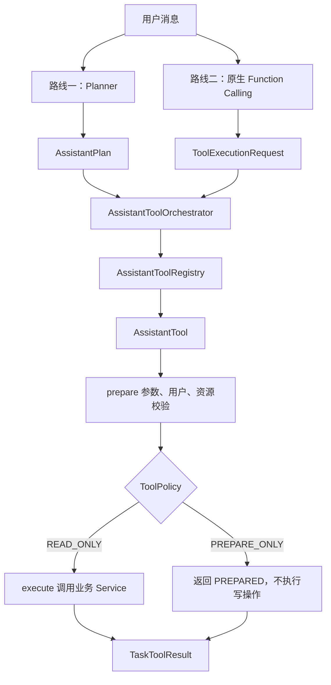

# 第二阶段 Tool Calling 源码学习文档

> 学习目标：沿真实请求流程理解 Planner 结果如何转换为 Java 工具调用，并掌握工具注册、参数校验、风险分级、用户隔离和结构化结果的实现方式。

## 1. 第二阶段解决什么问题

第一阶段已经完成：

```text
用户自然语言
  -> LLM Planner
  -> AssistantPlan
  -> Java 校验后的 PlannerResult
```

第二阶段继续解决：

> `AssistantPlan` 中的 `action` 如何映射为真实 Java 业务能力，以及后端如何保证 LLM 只能建议调用工具，不能绕过权限和风险策略直接修改业务数据。

第二阶段的主要产物：

- 统一工具接口 `AssistantTool`。
- 工具安全策略 `ToolPolicy`。
- 工具注册表 `AssistantToolRegistry`。
- 计划执行器 `AssistantToolOrchestrator`。
- 只读工具与高风险准备工具。
- Planner 驱动和原生 Function Calling 两条调用链。
- 统一任务结果 `TaskToolResult`。

阶段关系：

```text
第一阶段 Planner
  回答：用户想做什么？

第二阶段 Tool Calling
  回答：对应哪个 Java 工具？是否允许执行？执行结果是什么？
```

## 2. 建议的源码阅读顺序

不要先从具体工具细节开始。推荐按照调用方向阅读：

1. `AssistantToolController`
2. `AssistantToolOrchestrator`
3. `AssistantToolRegistry`
4. `AssistantTool`
5. `ToolPolicy` 与 `ToolRiskLevel`
6. `ToolContext`
7. `PreparedToolCall` 与 `ToolExecutionOutcome`
8. `ToolArguments`
9. `QueryOrderTool`
10. `PrepareCancelOrderTool`
11. `LangChain4jToolCallingModelGateway`
12. `NativeFunctionCallingService`
13. 第二阶段测试代码

阅读时始终带着四个问题：

```text
工具是谁选择的？
参数从哪里来？
权限由谁决定？
结果如何向上传递？
```

## 3. 总体架构

项目保留了两条工具选择路线，但最终进入同一套 Java 安全执行层。



两条路线的区别只在“模型如何选择工具”：

- Planner 路线：先生成完整 `AssistantPlan`，适合多任务、依赖和条件描述。
- 原生 Function Calling：模型直接返回工具名和参数，适合简单、短链路工具选择。

两条路线共享：

- 工具白名单。
- 参数校验。
- 当前用户上下文。
- 风险策略。
- 具体业务工具。
- 统一执行结果。

## 4. 主链路入口：Planner 驱动工具调用

接口：

```http
POST /api/assistant/tools/plan-preview
```

入口代码位于：

```text
src/main/java/com/aishop/assistant/web/AssistantToolController.java
```

核心代码：

```java
var user = authService.requireUser(session);

var plannerResult = plannerFacade.plan(new PlannerInput(
        request.message(),
        request.conversationSummary(),
        request.recentMessages()));

return toolOrchestrator.executePlan(user, plannerResult);
```

这段代码完成三个动作：

1. 从 Session 中取得当前登录用户。
2. 调用第一阶段 Planner 获得合法计划。
3. 把用户和计划交给 Orchestrator。

这里没有直接写：

```java
if (action == CANCEL_ORDER) {
    orderService.cancel(...);
}
```

Controller 只负责协议转换和调用应用服务，不负责工具路由与安全决策。

## 5. 示例计划如何进入第二阶段

假设用户输入：

```text
查询订单 ORD-12345678
```

第一阶段返回：

```json
{
  "planType": "SINGLE_TASK",
  "tasks": [
    {
      "taskId": "t1",
      "intent": "ORDER",
      "action": "QUERY_ORDER",
      "executionMode": "TOOL_READ",
      "slots": {
        "orderNo": "ORD-12345678"
      },
      "missingSlots": [],
      "dependsOn": [],
      "conditions": [],
      "confidence": 0.95,
      "reason": "用户要求查询指定订单"
    }
  ],
  "summary": "查询指定订单"
}
```

第二阶段主要消费这些字段：

```text
taskId       -> 保存任务结果、处理依赖
action       -> 查找对应工具
slots        -> 作为工具参数
missingSlots -> 判断是否需要用户补充参数
dependsOn    -> 排序和失败传播
```

当前 Orchestrator 不直接使用：

```text
intent        主要已在第一阶段完成契约校验
executionMode 主要已在第一阶段完成动作模式校验
confidence    当前没有执行阈值
reason        用于解释和调试
conditions    当前只校验，尚未运行时求值
```

真正的执行权限不依赖 LLM 返回的 `executionMode`，而依赖后端 `ToolPolicy`。

## 6. AssistantToolOrchestrator：执行流程核心

源码：

```text
src/main/java/com/aishop/assistant/orchestration/AssistantToolOrchestrator.java
```

入口：

```java
public ToolPlanExecutionResult executePlan(
        AppUser user,
        PlannerResult plannerResult) {

    ToolContext context = new ToolContext(
            user,
            UUID.randomUUID().toString());

    List<AssistantTask> sortedTasks = sort(plannerResult.plan());
    Map<String, TaskToolResult> completed = new LinkedHashMap<>();

    // 逐个处理任务
}
```

### 6.1 创建 ToolContext

`ToolContext` 包含：

```java
public record ToolContext(
        AppUser user,
        String requestId
) {}
```

作用：

- 强制工具绑定当前登录用户。
- 为本次调用生成请求标识。
- 后续可扩展租户、角色、链路追踪和幂等键。

它会拒绝匿名用户或没有 ID 的用户：

```java
if (user == null || user.getId() == null) {
    throw new IllegalArgumentException("工具调用必须绑定已登录用户");
}
```

安全意义：模型只能提供业务参数，不能提供或伪造“当前用户”。

### 6.2 根据 dependsOn 拓扑排序

```java
List<AssistantTask> sortedTasks = sort(plannerResult.plan());
```

例如：

```text
t1 QUERY_LOGISTICS dependsOn=[]
t2 CANCEL_ORDER    dependsOn=[t1]
```

排序结果必须是：

```text
t1 -> t2
```

`sort()` 使用 Kahn 拓扑排序：

1. 根据 `dependsOn.size()` 计算每个任务的入度。
2. 将入度为 0 的任务放入队列。
3. 取出任务后，将依赖它的任务入度减 1。
4. 新的入度为 0 时加入队列。
5. 最终数量不足说明存在循环依赖。

第一阶段已经检查依赖合法性，第二阶段仍保留运行时循环保护，避免非法计划绕过上层直接进入 Orchestrator。

### 6.3 检查依赖执行结果

排序只解决“先执行谁”，不代表前置任务一定成功。

```java
if (!dependenciesSucceeded(task, completed)) {
    status = SKIPPED_DEPENDENCY;
}
```

当前把以下状态视为依赖成功：

```text
SUCCEEDED
PREPARED
```

如果前置任务为 `FAILED`、`NEEDS_INPUT` 或 `NOT_SUPPORTED`，后续任务会跳过。

### 6.4 检查 missingSlots

```java
else if (task.missingSlots() != null
        && !task.missingSlots().isEmpty()) {
    status = NEEDS_INPUT;
}
```

例如：

```json
{
  "action": "QUERY_ORDER",
  "slots": {},
  "missingSlots": ["orderNo"]
}
```

此时工具的 `prepare()` 都不会被调用。上层应该根据：

```json
{
  "status": "NEEDS_INPUT",
  "data": {
    "missingSlots": ["orderNo"]
  }
}
```

向用户追问订单号。

### 6.5 根据 action 查找工具

```java
toolRegistry.find(task.action())
        .map(tool -> executeTool(
                context,
                task.taskId(),
                tool,
                task.slots()))
```

如果没有注册对应工具：

```text
status = NOT_SUPPORTED
```

这比使用大型 `switch` 更适合扩展：新增工具只需实现接口并注册为 Spring Bean，不需要修改 Orchestrator。

## 7. AssistantTool：统一工具协议

源码：

```text
src/main/java/com/aishop/assistant/tool/AssistantTool.java
```

接口：

```java
public interface AssistantTool {

    ToolPolicy policy();

    ToolSpecification specification();

    PreparedToolCall prepare(
            ToolContext context,
            Map<String, Object> arguments);

    ToolExecutionOutcome execute(
            ToolContext context,
            PreparedToolCall call);
}
```

四个部分的职责：

| 方法 | 作用 |
|---|---|
| `policy()` | 后端定义工具名、动作、风险和自动执行权限 |
| `specification()` | 向 LLM 描述工具及参数 Schema |
| `prepare()` | 参数规范化、鉴权、资源归属和业务前置检查 |
| `execute()` | 真正调用业务 Service 并返回结果 |

最关键的设计是把 `prepare()` 与 `execute()` 分开。

```text
prepare：判断“这次调用是否合法、准备做什么”
execute：真正产生业务读取或变更
```

这为后续 `PendingAction` 提供基础：高风险工具只运行 `prepare()`，把准备结果持久化，用户确认后再运行专门的确认执行逻辑。

## 8. ToolPolicy：最终权限由 Java 决定

源码：

```text
src/main/java/com/aishop/assistant/tool/ToolPolicy.java
```

结构：

```java
public record ToolPolicy(
        String name,
        String description,
        AssistantAction action,
        ToolRiskLevel riskLevel,
        boolean autoExecutable
) {}
```

当前风险级别：

```java
READ_ONLY,
PREPARE_ONLY
```

构造器还强制规定：

```java
if (riskLevel != ToolRiskLevel.READ_ONLY && autoExecutable) {
    throw new IllegalArgumentException("只有 READ_ONLY 工具可以自动执行");
}
```

这条规则在应用启动、创建工具策略时就会生效。

因此即使 LLM 返回：

```text
action=CANCEL_ORDER
executionMode=TOOL_READ
```

第一阶段会先拒绝错误组合；即使错误计划设法进入第二阶段，取消工具的 `ToolPolicy` 仍然是 `PREPARE_ONLY + false`，Orchestrator 不会调用 `execute()`。

这属于纵深防御：

```text
Prompt 约束
  -> Planner 校验
  -> SemanticGuard
  -> ToolRegistry 白名单
  -> ToolPolicy
  -> Tool 参数校验
  -> 业务 Service 鉴权
```

## 9. AssistantToolRegistry：建立工具白名单

源码：

```text
src/main/java/com/aishop/assistant/tool/AssistantToolRegistry.java
```

Spring 会把所有 `AssistantTool` Bean 注入构造器：

```java
public AssistantToolRegistry(List<AssistantTool> tools) {
    for (AssistantTool tool : tools) {
        ToolPolicy policy = tool.policy();
        actions.putIfAbsent(policy.action(), tool);
        names.putIfAbsent(policy.name(), tool);
    }
}
```

内部建立两张只读映射：

```text
AssistantAction -> AssistantTool
工具字符串名称   -> AssistantTool
```

用途分别是：

```text
Planner 路线：find(AssistantAction action)
原生路线：find(String toolName)
```

注册表还拒绝重复 action 和重复工具名，防止同一个动作在运行时出现两个不确定实现。

当前注册的工具：

| 工具名 | Action | 风险 |
|---|---|---|
| `query_order` | `QUERY_ORDER` | `READ_ONLY` |
| `query_logistics` | `QUERY_LOGISTICS` | `READ_ONLY` |
| `search_products` | `SEARCH_PRODUCT` | `READ_ONLY` |
| `search_knowledge` | `SEARCH_KNOWLEDGE` | `READ_ONLY` |
| `prepare_cancel_order` | `CANCEL_ORDER` | `PREPARE_ONLY` |

`SEARCH_KNOWLEDGE` 的 Tool 接口属于第二阶段，当前底层检索实现已经在第三阶段升级为混合 RAG 检索。

## 10. ToolSpecification：告诉模型工具怎么调用

以商品搜索为例：

```java
private static final ToolSpecification SPECIFICATION =
        ToolSpecification.builder()
                .name("search_products")
                .description("按关键词、分类和预算搜索在售商品...")
                .parameters(JsonObjectSchema.builder()
                        .addStringProperty("query", "商品关键词或用户需求")
                        .addStringProperty("category", "可选平台一级分类")
                        .addNumberProperty("budgetMin", "可选最低预算")
                        .addNumberProperty("budgetMax", "可选最高预算")
                        .required("query")
                        .additionalProperties(false)
                        .build())
                .strict(true)
                .build();
```

它描述：

- 工具叫什么。
- 工具能做什么。
- 参数名称和类型。
- 哪些参数必填。
- 是否允许额外字段。

但 `ToolSpecification` 仍然只是告诉模型如何生成调用。模型返回的参数还必须经过 Java 的 `prepare()` 校验。

## 11. ToolArguments：不信任模型参数

源码：

```text
src/main/java/com/aishop/assistant/tool/ToolArguments.java
```

主要能力：

```java
rejectUnknown(arguments, allowed);
requireString(arguments, name, maxLength);
optionalString(arguments, name, maxLength);
optionalDecimal(arguments, name);
```

以商品预算为例，`prepare()` 会检查：

```java
if (budgetMin != null
        && budgetMax != null
        && budgetMin.compareTo(budgetMax) > 0) {
    throw new IllegalArgumentException(
            "budgetMin 不能大于 budgetMax");
}
```

参数需要多层校验的原因：

```text
ToolSpecification 是给模型看的契约
ToolArguments 是后端真正执行的契约
```

任何来自 LLM 的内容都属于不可信输入。

## 12. PreparedToolCall：准备阶段的标准结果

结构：

```java
public record PreparedToolCall(
        AssistantAction action,
        String toolName,
        ToolRiskLevel riskLevel,
        Map<String, Object> arguments,
        String targetRef,
        Map<String, Object> preview
) {}
```

字段作用：

| 字段 | 作用 |
|---|---|
| `action` | 对应业务动作 |
| `toolName` | 实际工具名 |
| `riskLevel` | 后端风险等级 |
| `arguments` | 已校验和规范化的参数 |
| `targetRef` | 目标资源标识，例如订单号 |
| `preview` | 执行前给用户或上层展示的影响 |

为什么不能继续直接使用 LLM 原始 `slots`？

因为 `prepare()` 可能完成：

- 去除字符串前后空格。
- 订单号转成大写。
- 数字转换为 `BigDecimal`。
- 删除空参数。
- 校验目标资源存在。
- 校验资源归属当前用户。
- 生成用户可确认的操作预览。

`PreparedToolCall.arguments` 才是后端认可的参数。

## 13. 只读案例：QueryOrderTool 完整流程

源码：

```text
src/main/java/com/aishop/assistant/tool/tools/QueryOrderTool.java
```

### 13.1 策略

```java
new ToolPolicy(
        "query_order",
        "查询当前登录用户自己的订单概要...",
        AssistantAction.QUERY_ORDER,
        ToolRiskLevel.READ_ONLY,
        true);
```

含义：该工具只读，可以自动执行。

### 13.2 prepare

```java
ToolArguments.rejectUnknown(arguments, Set.of("orderNo"));

String orderNo = ToolArguments
        .requireString(arguments, "orderNo", 64)
        .toUpperCase();

OrderResponse order = orderService.findByOrderNo(
        context.user(),
        orderNo);
```

这里已经做了：

- 参数白名单。
- 必填和长度校验。
- 参数规范化。
- 当前用户订单归属校验。
- 订单存在性校验。

### 13.3 execute

```java
OrderResponse order = orderService.findByOrderNo(
        context.user(),
        (String) call.arguments().get("orderNo"));
```

然后只选择允许返回给模型或前端的字段，构造 `OrderView`，避免直接暴露整个数据库实体。

### 13.4 返回结果

```java
return new ToolExecutionOutcome(
        Map.of("order", view),
        "订单查询成功");
```

Orchestrator 最终包装为：

```text
status = SUCCEEDED
```

## 14. 高风险案例：PrepareCancelOrderTool

源码：

```text
src/main/java/com/aishop/assistant/tool/tools/PrepareCancelOrderTool.java
```

### 14.1 策略

```java
new ToolPolicy(
        "prepare_cancel_order",
        "只校验并准备取消当前登录用户自己的订单...",
        AssistantAction.CANCEL_ORDER,
        ToolRiskLevel.PREPARE_ONLY,
        false);
```

关键点：

```text
riskLevel = PREPARE_ONLY
autoExecutable = false
```

### 14.2 prepare

```java
OrderResponse order = orderService.findByOrderNo(
        context.user(),
        orderNo);

if (!canCancel(order.status())) {
    throw new IllegalArgumentException(
            "订单当前状态不支持取消: " + order.status());
}
```

检查完成后生成预览：

```json
{
  "orderNo": "ORD-12345678",
  "currentStatus": "CONFIRMED",
  "requiresConfirmation": true,
  "effect": "确认后订单状态将变更为 CANCELLED"
}
```

### 14.3 Orchestrator 阻止 execute

```java
if (!tool.policy().autoExecutable()) {
    return result(
            ...,
            ToolExecutionStatus.PREPARED,
            ...,
            "高风险动作仅完成准备，尚未执行业务变更");
}
```

因此 `execute()` 不会被调用。工具自身也再次防御：

```java
throw new SecurityException(
        "prepare_cancel_order 是 PREPARE_ONLY 工具，禁止自动执行取消订单");
```

第二阶段只证明“能够识别、校验和准备取消”，不能宣称“已经实现 AI 自动取消订单”。

## 15. TaskToolResult：统一任务状态

结构：

```java
public record TaskToolResult(
        String taskId,
        AssistantAction action,
        String toolName,
        ToolExecutionStatus status,
        Map<String, Object> arguments,
        String targetRef,
        Map<String, Object> data,
        String message
) {}
```

状态含义：

| 状态 | 含义 | 后续处理 |
|---|---|---|
| `SUCCEEDED` | 工具执行成功 | 使用 `data` 生成回答 |
| `PREPARED` | 高风险动作准备完成 | 创建待确认动作并询问用户 |
| `NEEDS_INPUT` | 缺少参数 | 追问用户 |
| `NOT_SUPPORTED` | 没有注册工具 | 降级回答或说明暂不支持 |
| `FAILED` | 参数、权限或业务异常 | 返回安全错误信息 |
| `SKIPPED_DEPENDENCY` | 前置任务失败 | 不执行当前任务 |

结构化状态比自然语言异常更适合状态机继续处理。

当前 `ToolPlanExecutionResult` 同时返回：

```text
planner     原始规划结果
taskResults 每个任务的执行结果
```

方便对照“模型计划了什么”和“后端实际做了什么”。

## 16. 原生 Function Calling 链路

接口：

```http
POST /api/assistant/tools/function-call-preview
```

完整链路：

```text
AssistantToolController
  -> NativeFunctionCallingService
  -> AssistantToolRegistry.specifications()
  -> LangChain4jToolCallingModelGateway
  -> ChatModel.chat(ChatRequest)
  -> AIMessage.toolExecutionRequests()
  -> 解析 name 和 arguments
  -> AssistantToolOrchestrator.executeNativeCall()
  -> Registry 按工具名查找
  -> prepare + ToolPolicy + execute
  -> FunctionCallingPreviewResult
```

### 16.1 把工具 Schema 交给模型

```java
ChatRequest request = ChatRequest.builder()
        .messages(
                SystemMessage.from(SYSTEM_PROMPT),
                UserMessage.from(message))
        .toolSpecifications(tools)
        .toolChoice(ToolChoice.AUTO)
        .temperature(0.0)
        .build();
```

`ToolChoice.AUTO` 表示模型可以：

- 不调用工具，直接输出文本。
- 调用一个工具。
- 返回多个工具调用请求。

真正调用模型：

```java
var response = chatModel.chat(request);
```

提取工具请求：

```java
aiMessage.toolExecutionRequests()
```

每个 `ToolExecutionRequest` 包含：

```text
id
name
arguments JSON 字符串
```

### 16.2 解析模型参数

`NativeFunctionCallingService` 将参数 JSON 转为 Map：

```java
Map<String, Object> arguments =
        argumentReader.readValue(request.arguments());
```

然后调用：

```java
orchestrator.executeNativeCall(
        context,
        callId,
        request.name(),
        arguments);
```

即使模型编造：

```text
delete_database
```

Registry 找不到，也只会返回 `NOT_SUPPORTED`。

### 16.3 当前原生链路的边界

当前实现是一次预览调用：

```text
模型选择工具
  -> Java 执行或准备工具
  -> 直接把结果返回接口
```

它还没有：

```text
工具结果
  -> 作为 ToolExecutionResultMessage 回传模型
  -> 模型继续选择下一工具或生成最终回答
```

因此它不是完整的多轮 Agent Loop，而是用于学习 LangChain4j 原生 Tool Calling 协议和后端安全复用的实验链路。

## 17. 两条路线如何比较

| 维度 | Planner 驱动 | 原生 Function Calling |
|---|---|---|
| 模型输出 | 完整 `AssistantPlan` | `ToolExecutionRequest` |
| 工具路由 | 按 `AssistantAction` | 按工具字符串名称 |
| 多任务依赖 | 有 `dependsOn` | 当前没有依赖图 |
| 条件描述 | 有 `conditions` | 当前没有统一条件结构 |
| 参数来源 | `slots` | `arguments` JSON |
| 适合场景 | 多步骤、可审计规划 | 简单直接的工具选择 |
| 后端安全层 | 共用 | 共用 |

不要把它们理解成只能二选一。更完整的 Agent 可以：

```text
Planner 生成任务图
  -> 每个任务内部使用 Tool Calling 选择具体工具
  -> Java 状态机控制依赖、确认和恢复
```

## 18. 从零实现第二阶段的顺序

如果自己重写，推荐按以下顺序实现。

### 第一步：定义领域动作

先定义有限的 `AssistantAction`，例如：

```text
QUERY_ORDER
QUERY_LOGISTICS
SEARCH_PRODUCT
CANCEL_ORDER
```

不要让工具名直接散落在业务代码中。

### 第二步：定义 ToolPolicy

明确每个工具：

```text
名称
动作
风险级别
是否允许自动执行
```

先建立“不允许写工具自动执行”的构造器约束。

### 第三步：定义 AssistantTool

拆分：

```text
specification
prepare
execute
```

不要让 LLM 直接调用业务 Service。

### 第四步：实现 ToolContext

至少包含：

```text
当前登录用户
requestId
```

用户身份必须来自 Session、JWT 或服务端认证上下文，不能来自模型参数。

### 第五步：实现参数工具类

统一处理：

- 未知字段。
- 必填字段。
- 类型转换。
- 长度限制。
- 数值范围。
- 标准化。

### 第六步：先实现一个只读工具

建议从 `QueryOrderTool` 开始，走通：

```text
slots
  -> prepare
  -> 当前用户资源检查
  -> execute
  -> ToolExecutionOutcome
```

### 第七步：实现 Registry

维护：

```text
action -> tool
name   -> tool
```

拒绝重复注册和未知工具。

### 第八步：实现 Orchestrator

执行顺序：

```text
检查依赖
  -> 检查缺失参数
  -> 查找工具
  -> prepare
  -> 判断 ToolPolicy
  -> READ_ONLY 才 execute
  -> 统一包装结果
```

### 第九步：增加高风险准备工具

实现 `PrepareCancelOrderTool`，验证：

```text
prepare 被调用
execute 绝不被调用
返回 PREPARED
```

### 第十步：接入 Planner

把第一阶段 `PlannerResult` 交给 Orchestrator，完成主链路。

### 第十一步：再接原生 Function Calling

复用同一 Registry 和 Orchestrator，避免原生 Function Calling 形成另一套绕过安全策略的执行通道。

## 19. 应重点阅读的测试

### AssistantToolOrchestratorTest

源码：

```text
src/test/java/com/aishop/assistant/orchestration/AssistantToolOrchestratorTest.java
```

关键用例：

- 只读工具会执行一次。
- 高风险工具只准备，不调用 `execute()`。
- 缺少参数时不调用 `prepare()`。
- 前置任务失败时跳过依赖任务。
- 未注册 action 返回 `NOT_SUPPORTED`。

最有价值的断言：

```java
assertThat(result.taskResults().getFirst().status())
        .isEqualTo(ToolExecutionStatus.PREPARED);

assertThat(tool.executeCount).hasValue(0);
```

它验证的是安全行为，而不只是代码覆盖率。

### NativeFunctionCallingServiceTest

源码：

```text
src/test/java/com/aishop/assistant/function/NativeFunctionCallingServiceTest.java
```

关键用例：

- 模型选择的只读工具可以执行。
- 模型选择的高风险工具只能准备。
- 模型编造未知工具不会执行任何能力。
- 非法 arguments JSON 被拒绝。
- 未配置真实模型时原生链路不可用。

### 具体工具测试

重点文件：

```text
src/test/java/com/aishop/assistant/tool/OrderToolsTest.java
src/test/java/com/aishop/assistant/tool/SearchProductToolTest.java
src/test/java/com/aishop/assistant/tool/SearchKnowledgeToolTest.java
src/test/java/com/aishop/assistant/tool/ToolPolicyAndRegistryTest.java
```

阅读测试时关注四类边界：

```text
正常输入
缺失或非法参数
权限或资源归属
高风险动作是否被阻断
```

## 20. 当前实现的不足

学习源码时要明确当前阶段没有完成的能力。

### 20.1 conditions 没有求值

`dependsOn` 已经用于排序和失败传播，但 `conditions` 目前没有读取前置任务 `data` 做判断。

因此还缺少通用：

```text
ConditionEvaluator
```

### 20.2 没有结果参数绑定

当前后续任务的 `slots` 主要由 Planner 直接提供，尚未实现：

```text
t1.data.orderNo -> t2.arguments.orderNo
```

后续可引入结构化 `inputBindings`，不要使用字符串模板随意取值。

### 20.3 PREPARED 没有持久化

取消订单的准备结果只存在当前 HTTP 响应中，没有写入 `PendingAction` 表，因此不能跨请求确认和恢复。

### 20.4 没有最终回答生成

Planner 工具链返回结构化工具结果，还没有统一把结果交给 Answer Composer 生成自然语言客服回答。

### 20.5 原生 Function Calling 不是 Agent Loop

当前只执行模型第一次提出的工具调用，没有把工具结果返回模型继续推理。

## 21. 第二阶段最重要的设计思想

### 21.1 模型负责选择，后端负责授权

```text
LLM：建议调用 query_order
Java Registry：这个工具是否存在
ToolPolicy：是否允许自动执行
Tool：参数和资源是否合法
Service：当前用户是否有权限
```

### 21.2 ToolSpecification 不是安全边界

Schema 可以减少模型参数错误，但真正安全边界必须位于 Java：

```text
ToolArguments
ToolPolicy
ToolContext
业务 Service
```

### 21.3 prepare 与 execute 分离

这是后续二次确认、审计和恢复的基础。

```text
低风险：prepare -> execute
高风险：prepare -> PendingAction -> 用户确认 -> 重新校验 -> execute
```

### 21.4 所有模型入口共用执行层

Planner 和原生 Function Calling 可以有不同的模型协议，但不能各自实现一套权限逻辑。

```text
多个模型入口
  -> 一个 Registry
  -> 一个 Orchestrator
  -> 一套 ToolPolicy
```

## 22. 学完后的自测问题

1. `AssistantAction` 和工具字符串名称有什么区别？
2. Planner 路线为什么按 action 查找，原生路线为什么按 name 查找？
3. `ToolSpecification` 与 `ToolArguments` 为什么都需要？
4. `prepare()` 和 `execute()` 分别负责什么？
5. 为什么不能让 LLM 在参数中传 `userId`？
6. `ToolContext` 如何参与越权防护？
7. 为什么 `executionMode=ASK_CONFIRM` 还不够安全？
8. 哪段 Java 代码真正阻止取消工具自动执行？
9. `PREPARED` 和 `SUCCEEDED` 的业务含义有什么区别？
10. `dependsOn` 如何影响工具执行顺序和失败传播？
11. 当前为什么还不能完成“如果未发货则取消”的通用条件编排？
12. 模型编造 `delete_database` 工具时为什么无法执行？
13. 原生 Function Calling 为什么还不是完整 Agent Loop？
14. 后续如何从 `PREPARED` 演进到可恢复的 `PendingAction`？

## 23. 第二阶段面试表达

可以这样介绍：

> 在 LLM Planner 生成结构化任务计划后，我设计了统一的 Java Tool 抽象和注册表，将计划中的 action 映射到具体业务能力；通过 ToolContext 绑定当前登录用户，通过 ToolArguments 对模型参数执行白名单、类型和长度校验，并使用 ToolPolicy 将工具划分为 READ_ONLY 与 PREPARE_ONLY。查询类工具可自动执行，取消订单等高风险动作只完成权限、订单归属和状态校验并返回 PREPARED，模型无法直接修改业务数据。同时保留 Planner 驱动和 LangChain4j 原生 Function Calling 两条入口，两者共用同一套 Orchestrator 和安全策略。

一句话总结：

> 第二阶段不是简单地让 LLM 调用 Java 方法，而是建立一层确定性的工具执行边界，把模型的不确定选择转换为可校验、可审计、受权限约束的业务调用。
