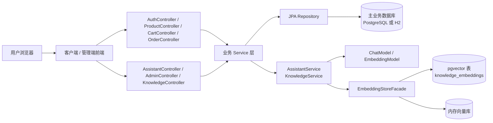
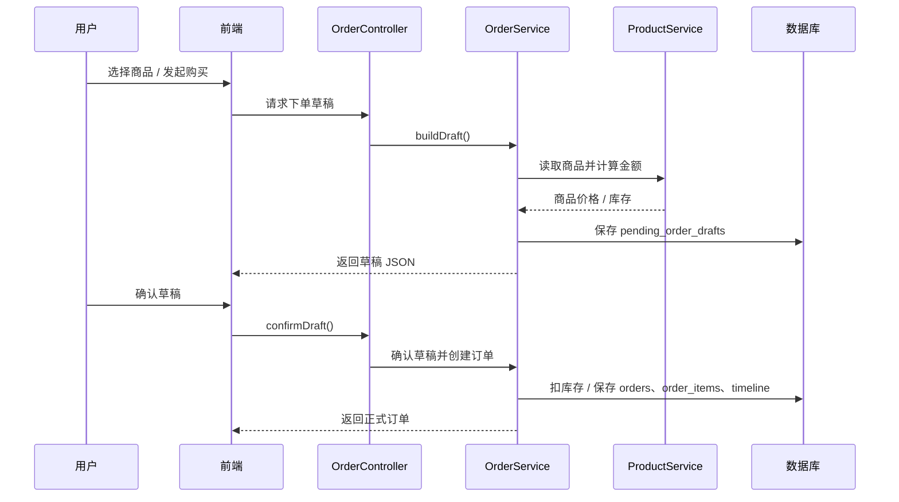
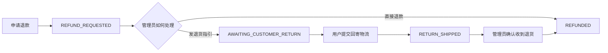
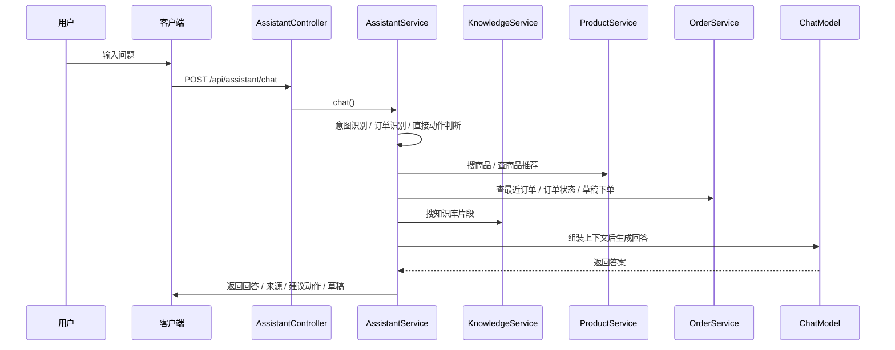

# AI Shop 项目详细设计说明

## 1. 项目定位

AI Shop 是一个基于 Spring Boot 3 的前后端分离电商平台示例，包含客户端、管理端、AI 客服、RAG 知识库、订单履约、售后处理、优惠活动、评价与客户画像等模块。

它不是一个只有页面的演示壳，而是一套“业务数据真的落库、流程真的能跑、AI 真的参与业务”的项目：

- 客户端负责浏览商品、购物车、下单、支付、订单查询、售后、收藏、地址管理和 AI 客服
- 管理端负责商品、促销、订单、售后、知识库、人工客服接管、客户画像和发票
- AI 层负责商品推荐、订单问答、售后问答、知识库问答、草稿下单、直接业务操作和人工转接

项目支持两种运行方式：

- 集成模式：Spring Boot 同时托管静态客户端和管理端页面
- 分离模式：`frontend/` 独立前端工程通过 Vite 运行，调用后端 REST API

## 2. 总体架构

底层调用顺序基本都是：

`页面 -> Controller -> Service -> Repository -> Entity -> 数据库 -> Response`

AI 链路额外多一层：

`页面 -> /api/assistant/chat -> AssistantService -> 业务上下文检索 -> 模型推理 -> 返回答案和建议动作`

## 3. 功能模块

### 3.1 客户端

- 注册、登录、退出、个人资料维护
- 收货地址新增、编辑、设为默认、删除
- 商品列表、分类浏览、关键词搜索、详情页、评论和口碑摘要
- 收藏商品、取消收藏
- 购物车增删改、结算、优惠码、模拟支付
- 订单列表、订单详情、订单时间线、物流节点、确认收货
- 退货退款、回寄物流提交、发票申请
- AI 客服问答、订单查询、商品推荐、草稿下单、人工转接

### 3.2 管理端

- 仪表盘：用户数、商品数、订单数、营收、知识库数量、低库存、待发货
- 商品管理：新增、编辑、库存、分类
- 营销管理：固定金额券、折扣券、门槛、启停、过期时间
- 订单管理：改状态、补物流、补备注、手动补录支付
- 售后工作台：退款审核、发送退货指引、确认收货退款
- 知识库：导入原文、查看切块、重建索引、语义检索
- AI 会话：会话列表、认领、转交、回复、结案
- 客户画像：累计消费、偏好、行为、收藏、售后风险、AI 对话
- 发票：开具、驳回、查看状态

### 3.3 AI 客服

AI 客服不是单纯聊天，而是把业务信息喂给模型，让它能：

- 查商品
- 查订单
- 查物流
- 查售后
- 查优惠
- 生成下单草稿
- 直接执行部分操作
- 不确定时转人工

## 4. 核心业务链路

### 4.1 商品浏览到下单

关键点：

- AI 先根据上下文生成 `pending_order_drafts`
- 用户确认后，`OrderService.confirmDraft()` 才真正落单
- 下单时会扣库存，并生成订单项快照
- 订单项保存的是商品名、SKU、数量、单价、行金额，避免商品后续改名影响历史订单

### 4.2 支付、发货、确认收货

1. 用户在客户端对 `PENDING_PAYMENT` 订单发起支付
2. `OrderService.payOrder()` 将订单改为 `CONFIRMED`
3. 管理端发货时写入物流公司和运单号，状态转为 `SHIPPED`
4. 用户收到货后调用 `confirmReceipt()`，订单变为 `COMPLETED`
5. `OrderTimelineService` 会同步记录时间线

### 4.3 售后退款链路

售后有两条路径，语义要分开：

#### 直接退款

- 用户发起退款申请
- `OrderService.requestRefund()`
- 订单状态进入 `REFUND_REQUESTED`
- 管理端审核通过后，`AdminService.reviewRefund()` 直接把订单和售后工单推进到 `REFUNDED`

#### 退货回寄后退款

- 用户发起退款申请
- 管理端发送退货指引：`provideReturnInstructions()`
- 售后状态变为 `AWAITING_CUSTOMER_RETURN`
- 用户提交回寄物流：`submitReturnShipment()`
- 售后状态变为 `RETURN_SHIPPED`
- 管理端确认收到退货：`confirmReturnAndRefund()`
- 订单和售后状态最终变为 `REFUNDED`

### 4.4 AI 客服链路

AI 客服会按优先级处理：

1. 明确业务动作，能直接执行就直接执行
2. 能从订单、商品、优惠、知识库里查到，就先查再答
3. 信息不完整时，生成草稿或建议动作
4. 用户要转人工时，进入人工客服队列

## 5. AI 如何发挥作用

### 5.1 模式切换

项目通过 `SHOP_AI_ENABLED` 决定是否启用真实模型：

- `false`：本地兜底聊天模型 + 本地兜底 embedding
- `true`：走 OpenAI 兼容接口，默认对接 DashScope

对应配置由 `AiModelConfig` 和 `LocalChatModelConfig`、`LocalEmbeddingConfig` 共同完成。

### 5.2 聊天模型

`AssistantService` 会把这些上下文拼进提示词：

- 用户昵称
- 当前会话 ID
- 用户消息
- 意图分类
- 默认收货地址
- 候选商品
- 最近收藏
- 最近商品行为
- 最近订单
- 当前优惠活动
- 相关知识片段

模型不是“裸聊”，而是带着业务上下文回答。

### 5.3 直接业务动作

`AssistantService.executeDirectAction()` 会识别用户是否在明确要求：

- 直接支付
- 直接取消
- 直接确认收货
- 直接申请退款
- 直接修改地址
- 转人工客服

如果识别为明确动作，就直接调用对应的业务 Service，不再只生成自然语言。

### 5.4 草稿下单

当用户说出购买意图时，AI 会先调用 `OrderService.buildDraft()` 生成一个 `pending_order_drafts` 记录：

- 保存商品 ID、名称、数量、单价、总价和备注
- 由用户确认后再 `confirmDraft()`
- 确认后才创建真实订单

这相当于把“先聊，再确认，再下单”拆成了两步。

### 5.5 人工转接

用户显式要求人工客服时：

- 会话状态变成 `ESCALATED`
- 新消息会同步到人工客服队列
- 管理端回复后，消息会回流到客户端会话里

### 5.6 运行态判断

`GET /api/assistant/health` 会返回：

- 当前是 `REMOTE_MODEL` 还是 `LOCAL_FALLBACK`
- 当前 embedding 是真实模型还是本地假向量
- 向量库是 `PGVECTOR` 还是 `IN_MEMORY`
- 知识文档数量、切块数量、已索引片段数量

这比单纯看页面能不能聊天更可靠。

### 5.7 LangGraph 的作用

项目里接入了 LangGraph4j，但当前工作流是轻量的：

- 先跑一条 `assistant-workflow`
- 主要用于线程状态和 checkpoint
- 真正的业务判断还是在 `AssistantService`

也就是说，它是“工作流骨架”，不是把整套业务逻辑都藏进图里。

## 6. RAG 与向量检索

### 6.1 导入原文

知识库导入发生在 `KnowledgeService.importDocument()`：

1. 保存 `knowledge_documents`
2. 按段落和长度切块
3. 保存 `knowledge_chunks`
4. 计算每个 chunk 的 embedding
5. 将 embedding 先落到 `knowledge_chunks.embeddingJson`
6. 再写入向量库

### 6.2 检索流程

检索发生在 `KnowledgeService.search()`：

1. 规范化用户关键词
2. 先做文本命中
3. 再做向量召回
4. 合并文本命中和向量命中
5. 排序后返回 topK

### 6.3 启动时索引同步

`KnowledgeIndexSynchronizer` 在启动时会：

- 读取全部 `knowledge_chunks`
- 清空向量库
- 重新把 chunk 的 embedding 和 metadata 写回去
- 如果缓存 embedding 失效，会重新计算

### 6.4 向量库模式

向量库由 `EmbeddingStoreConfig` 自动选择：

- AI 关闭时：内存向量库
- AI 开启且配置了 PostgreSQL：`PgVectorEmbeddingStore`
- 其他情况：回退到内存向量库

默认表名是 `knowledge_embeddings`，由 `rag.pgvector.table` 控制。

## 7. 数据表结构设计

### 7.1 设计原则

这个项目的表结构不是单纯“把所有信息塞进一张表”，而是按业务语义拆分：

- 主实体表保存核心事实
- 订单项保存快照，避免商品改名影响历史
- 时间线表保存过程事件
- 售后和发票用独立一对一表扩展
- AI 会话和消息分表
- 知识库原文和切块分表
- 行为、收藏、草稿、地址都独立存储

### 7.2 核心表

| 表名 | 作用 | 关键字段 | 关系 |
|---|---|---|---|
| `app_users` | 用户主表 | `username`, `password_hash`, `display_name`, `phone`, `shipping_address`, `preferences_summary`, `role` | 被订单、地址、收藏、评价、AI 会话引用 |
| `product_categories` | 商品分类 | `name`, `description` | `products.category_id` |
| `products` | 商品主表 | `sku`, `name`, `description`, `price`, `stock`, `image_url`, `category_id` | 被购物车、订单项、收藏、评价、行为引用 |
| `carts` | 购物车主表 | `user_id`, `checked_out` | `cart_items.cart_id` |
| `cart_items` | 购物车明细 | `cart_id`, `product_id`, `quantity`, `unit_price` | 属于购物车，关联商品 |
| `shipping_addresses` | 用户地址簿 | `user_id`, `label`, `recipient_name`, `phone`, `address_line`, `default_address` | 同步到用户默认收货地址 |
| `promotion_campaigns` | 促销活动 | `code`, `title`, `discount_type`, `discount_value`, `min_order_amount`, `active`, `expires_at` | 订单结算引用活动码 |
| `orders` | 订单主表 | `order_no`, `user_id`, `status`, `total_amount`, `original_amount`, `discount_amount`, `promotion_code`, `shipping_address`, `shipping_carrier`, `tracking_no`, `payment_method`, `paid_at`, `risk_note` | `order_items`、`order_timeline_events`、`after_sales_cases`、`order_invoices` |
| `order_items` | 订单明细快照 | `order_id`, `product_name`, `product_sku`, `quantity`, `unit_price`, `line_total` | 属于订单，后续商品变化不影响历史 |
| `order_timeline_events` | 订单时间线 | `order_id`, `event_type`, `title`, `detail`, `actor_label`, `occurred_at` | 给客户端和管理端同步展示 |
| `after_sales_cases` | 售后工单 | `order_id`, `status`, `customer_reason`, `admin_reply`, `return_required`, `return_address`, `return_carrier`, `return_tracking_no`, `return_note`, `requested_at`, `admin_responded_at`, `customer_shipped_at`, `resolved_at` | 与订单一对一 |
| `order_invoices` | 发票申请 | `order_id`, `status`, `header_type`, `invoice_title`, `tax_no`, `email`, `note`, `admin_reply`, `invoice_no`, `requested_at`, `reviewed_at`, `issued_at` | 与订单一对一 |

### 7.3 AI 与行为相关表

| 表名 | 作用 | 关键字段 | 关系 |
|---|---|---|---|
| `assistant_sessions` | AI 会话主表 | `user_id`, `title`, `summary`, `last_intent`, `service_status`, `assigned_admin_id`, `assigned_at`, `first_support_reply_at`, `resolved_at`, `support_unread_count`, `customer_unread_count` | `assistant_messages`、人工接管 |
| `assistant_messages` | AI 会话消息 | `session_id`, `role`, `content` | 属于会话 |
| `pending_order_drafts` | AI 下单草稿 | `user_id`, `thread_id`, `draft_json`, `status` | 由 AI 生成，用户确认后转正式订单 |
| `customer_product_events` | 商品行为日志 | `user_id`, `product_id`, `event_type`, `source`, `detail`, `quantity` | 支撑推荐和 AI 上下文 |
| `product_favorites` | 收藏关系 | `user_id`, `product_id` | 用户与商品多对多的中间表 |
| `product_reviews` | 评价 | `product_id`, `user_id`, `order_id`, `order_item_id`, `rating`, `content` | 订单完成后评论 |

### 7.4 知识库相关表

| 表名 | 作用 | 关键字段 | 关系 |
|---|---|---|---|
| `knowledge_documents` | 知识原文 | `title`, `doc_type`, `content` | 一个文档可切成多个 chunk |
| `knowledge_chunks` | 知识切块 | `document_id`, `chunk_text`, `embedding_json` | 与文档一对多 |
| `knowledge_embeddings` | 向量索引表 | 由 LangChain4j / pgvector 自动维护 | 对应 `knowledge_chunks` 的向量化结果 |

### 7.5 基础审计字段

所有继承 `BaseEntity` 的表都带：

- `id`
- `created_at`
- `updated_at`

这让订单、消息、知识库、售后、行为等模块都能统一按时间排序和追踪。

### 7.6 Spring Session 表

登录态由 Spring Session JDBC 维护，常见表是：

- `SPRING_SESSION`
- `SPRING_SESSION_ATTRIBUTES`

项目里没有手写这些实体，但登录态、cookie 和 session 依赖它们。

## 8. 底层怎么操作

### 8.1 订单操作

- `OrderService.buildDraft()`：生成 AI 下单草稿
- `OrderService.confirmDraft()`：真正扣库存、创建订单、保存订单项
- `OrderService.payOrder()`：模拟支付，记录支付流水
- `OrderService.cancelOrder()`：取消订单并恢复库存
- `OrderService.confirmReceipt()`：确认收货，订单完成
- `OrderService.requestRefund()`：创建售后申请
- `OrderService.submitReturnShipment()`：用户提交回寄物流

### 8.2 管理端操作

- `AdminService.updateOrderStatus()`：订单状态手动推进
- `AdminService.reviewRefund()`：退款审核
- `AdminService.provideReturnInstructions()`：发退货指引
- `AdminService.confirmReturnAndRefund()`：确认收货并退款
- `AdminService.issueInvoice()` / `rejectInvoice()`：发票处理

### 8.3 知识库操作

- `KnowledgeService.importDocument()`：导入原文并切块
- `KnowledgeService.search()`：检索知识片段
- `KnowledgeIndexSynchronizer.reindexAll()`：启动时重建索引

### 8.4 行为和画像

- `CustomerBehaviorService` 记录浏览、加购、收藏、结算、AI 咨询等事件
- `ProductFavoriteService` 维护收藏关系
- `ShippingAddressService` 同步用户默认地址

这些数据最后会被 AI 客服和管理端画像一起使用。

## 9. 前后端分离与页面入口

### 9.1 集成模式

后端直接托管静态资源：

- 客户端：`/client/index.html`
- 管理端：`/admin/index.html`
- AI 客服直达：`/assistant.html`

`PageController` 会把：

- `/` 重定向到客户端
- `/assistant.html` 重定向到客户端 AI 客服区
- `/admin` 重定向到管理端
- `/client` 重定向到客户端

### 9.2 分离模式

`frontend/` 是独立前端工程，Vite 启动后：

- `/api/*` 代理到后端
- 适合本地联调
- 前端会自动探测后端端口，或使用 `VITE_BACKEND_TARGET`

## 10. 目前这套 AI 电商的特点

这套系统的重点不是“有一个聊天入口”，而是把 AI 真正放进业务里：

- AI 能查商品，不只是回答闲聊
- AI 能查订单，不只是生成自然语言
- AI 能根据知识库回答售后、物流、政策
- AI 能生成下单草稿
- AI 能直接调用业务方法完成支付、取消、确认收货、申请退款、改地址
- AI 不确定时能转人工
- 管理端能看到会话、接管、回复和结案

## 11. 当前边界

这份文档描述的是当前版本，不是生产系统承诺：

- 支付是模拟支付
- 物流是人工录入
- 向量库在未接 PostgreSQL 时会回退到内存
- 本地模式下聊天和 embedding 走兜底实现
- 自动化测试和生产化运维还没补齐

如果要继续往生产级做，下一步通常是：

- 接真实支付
- 接真实物流
- 补并发库存锁
- 补完整测试
- 补部署、监控和告警

## 12. 快速查代码

- 客户端页面：`src/main/resources/static/client/index.html`
- 管理端页面：`src/main/resources/static/admin/index.html`
- 客户端脚本：`src/main/resources/static/scripts/client-app.js`
- 管理端脚本：`src/main/resources/static/scripts/admin-app.js`
- AI 主逻辑：`src/main/java/com/aishop/service/AssistantService.java`
- RAG 导入与检索：`src/main/java/com/aishop/service/KnowledgeService.java`
- 向量库适配：`src/main/java/com/aishop/service/EmbeddingStoreFacade.java`
- pgvector 适配：`src/main/java/com/aishop/service/PgVectorEmbeddingStoreFacade.java`
- 本地向量库：`src/main/java/com/aishop/service/InMemoryEmbeddingStoreFacade.java`
- 订单主链路：`src/main/java/com/aishop/service/OrderService.java`
- 售后主链路：`src/main/java/com/aishop/service/AfterSalesService.java`
- 订单时间线：`src/main/java/com/aishop/service/OrderTimelineService.java`
- 数据初始化：`src/main/java/com/aishop/config/DataInitializer.java`
- 运行态检查：`src/main/java/com/aishop/service/AssistantRuntimeStatusService.java`

